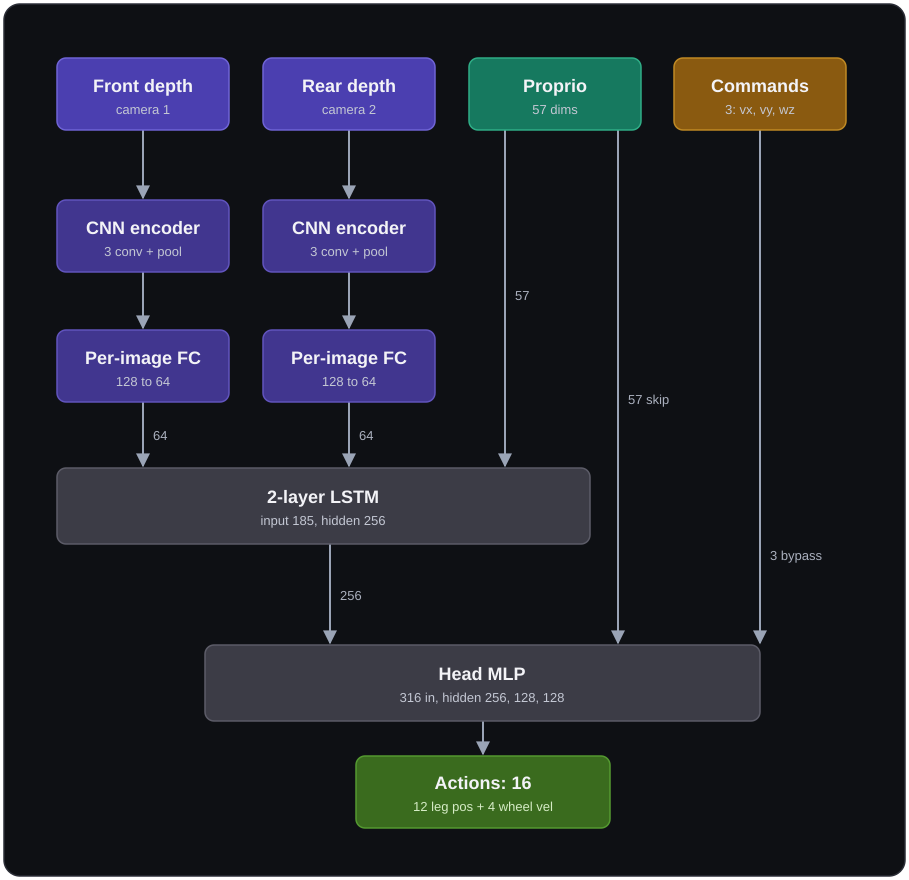

# Training to Deployment Pipeline for Unitree B2W (near-locomotion-quadruped repo)

> **Branch:** this documentation lives on the `b2w-distillation-training` branch of the main repo.

The B2W has 16 DOF: 12 leg joints (FR/FL/RR/RL × hip/thigh/calf) controlled by position PD, and 4 wheel joints (FR/FL/RR/RL foot). Three submodule repos work together:

| Repo | Role |
|---|---|
| `robot_lab/` | Isaac Lab task definitions, training config, and `train.py` / `play.py` scripts - where the RL policy is trained and exported to ONNX |
| `unitree_rl_lab/` | C++ deployment controller (`deploy/robots/b2w/`) that loads the ONNX policy and sends joint commands over DDS |
| `unitree_mujoco/` | MuJoCo simulator that receives DDS commands and simulates the B2W - used for sim2sim validation before deploying to the real robot |

RL policy trained in `robot_lab` --> exported to ONNX via `play.py` --> C++ controller in `unitree_rl_lab` loads that ONNX & runs it against either `unitree_mujoco` (sim2sim) or the real robot (sim2real) over DDS.

## Table of Contents

<ul>
  <li><a href="#1-repository-layout">1. Repository Layout</a></li>
  <li><details><summary><a href="#2-environment-setup">2. Environment Setup</a></summary><ul>
    <li><a href="#21-system-container-was-tested-on">2.1 System Container Was Tested On</a></li>
    <li><a href="#22-what-the-container-downloads">2.2 What the Container Downloads</a></li>
    <li><a href="#23-quick-start---dev-container">2.3 Quick Start - Dev Container</a></li>
    <li><a href="#24-shell-functions">2.4 Shell Functions</a></li>
  </ul></details></li>
  <li><details><summary><a href="#3-mujoco-sim2sim-validation-setup">3. MuJoCo Sim2Sim Validation Setup</a></summary><ul>
    <li><a href="#31-overview">3.1 Overview</a></li>
    <li><a href="#32-prerequisite-installation">3.2 Prerequisite Installation</a></li>
    <li><a href="#33-check-this-before-running-sim2sim">3.3 Check this before running sim2sim</a></li>
    <li><a href="#34-terrain-generation">3.4 Terrain Generation</a></li>
    <li><a href="#35-switching-to-gamepad">3.5 Switching to Gamepad</a></li>
    <li><a href="#36-code-changes-made">3.6 Code Changes Made</a></li>
  </ul></details></li>
  <li><details><summary><a href="#4-workflow">4. Workflow</a></summary><ul>
    <li><a href="#41-step-1---train-teacher-in-isaac-lab">4.1 Step 1 - Train Teacher in Isaac Lab</a></li>
    <li><a href="#42-step-1b---watch-the-robot-walk-in-isaac-sim">4.2 Step 1b - Watch the Robot Walk in Isaac Sim</a></li>
    <li><a href="#43-step-1c---distillation-student-teacher">4.3 Step 1c - Distillation (Student-Teacher)</a></li>
    <li><a href="#44-policy-generations-and-support-matrix">4.4 Policy Generations and Support Matrix</a></li>
    <li><a href="#45-step-2---export-to-onnx">4.5 Step 2 - Export to ONNX</a></li>
    <li><a href="#46-step-2a---evaluate-policies-per-level-evaluation-csv">4.6 Step 2a - Evaluate Policies (Per-Level Evaluation CSV)</a></li>
    <li><a href="#47-step-3---sim2sim-in-mujoco">4.7 Step 3 - Sim2Sim in MuJoCo</a></li>
    <li><a href="#48-step-3b---generate-rough-terrain">4.8 Step 3b - Generate rough terrain</a></li>
    <li><a href="#49-step-4---sim2real-to-be-tested">4.9 Step 4 - Sim2Real (to be tested)</a></li>
  </ul></details></li>
  <li><details><summary><a href="#5-curriculum-training-with-different-terrain">5. Curriculum Training with Different Terrain</a></summary><ul>
    <li><a href="#51-training-command">5.1 Training Command</a></li>
    <li><a href="#52-sub-terrains-the-default-mix">5.2 Sub-Terrains (the default mix)</a></li>
    <li><a href="#53-terrain-difficulty-curriculum">5.3 Terrain Difficulty Curriculum</a></li>
    <li><a href="#54-plug-in-a-different-terrain">5.4 Plug in a different terrain</a></li>
    <li><a href="#55-worked-example-rough-v1-walking-policy-expert">5.5 Worked example: rough-v1 walking policy expert</a></li>
    <li><a href="#56-multi-expert-terrain">5.6 Multi-Expert Terrain</a></li>
  </ul></details></li>
  <li><details><summary><a href="#6-evaluation-matrix">6. Evaluation Matrix</a></summary><ul>
    <li><a href="#61-command">6.1 Command</a></li>
    <li><a href="#62-evaluation-settings">6.2 Evaluation Settings</a></li>
    <li><a href="#63-what-the-csv-records">6.3 What the CSV Records</a></li>
    <li><a href="#64-files-and-reasoning">6.4 Files and Reasoning</a></li>
  </ul></details></li>
  <li><details><summary><a href="#7-skills-trained-on">7. Skills Trained On</a></summary><ul>
    <li><a href="#71-successfully-trained-on">7.1 Successfully trained on</a></li>
  </ul></details></li>
  <li><details><summary><a href="#8-b2w-config-verify-before-sim2real">8. B2W Config (Verify Before Sim2Real)</a></summary><ul>
    <li><a href="#81-source-of-truth---unitreepy">8.1 Source of Truth - unitree.py</a></li>
    <li><a href="#82-checklist---verify-before-sim2real">8.2 Checklist - Verify Before Sim2Real</a></li>
    <li><a href="#83-dcmotor-speed-torque-matching-in-mujoco">8.3 DCMotor Speed-Torque Matching in MuJoCo</a></li>
  </ul></details></li>
  <li><details><summary><a href="#9-challenges-faced">9. Challenges Faced</a></summary><ul>
    <li><a href="#91-fixstand-wheel-skid---bug-that-passed-in-sim-but-failed-on-the-real-robot">9.1 FixStand wheel skid - bug that passed in sim but failed on the real robot</a></li>
  </ul></details></li>
  <li><details><summary><a href="#10-deriving-π-in-rl">10. Deriving π in RL</a></summary><ul>
    <li><a href="#101-defining-q-function">10.1 Defining Q-function</a></li>
  </ul></details></li>
  <li><details><summary><a href="#11-proximal-policy-optimisation-ppo-teacher">11. Proximal Policy Optimisation: PPO (Teacher)</a></summary><ul>
    <li><a href="#111-hyperparameters">11.1 Hyperparameters</a></li>
    <li><a href="#112-the-combined-ppo-loss">11.2 The Combined PPO Loss</a></li>
    <li><a href="#113-clipped-surrogate-objective">11.3 Clipped Surrogate Objective</a></li>
    <li><a href="#114-value-critic-loss">11.4 Value (Critic) Loss</a></li>
    <li><a href="#115-entropy-bonus">11.5 Entropy Bonus</a></li>
    <li><a href="#116-generalised-advantage-estimation-gae">11.6 Generalised Advantage Estimation (GAE)</a></li>
    <li><a href="#117-adaptive-kl-based-learning-rate-schedule">11.7 Adaptive KL-based learning-rate schedule</a></li>
    <li><a href="#118-on-policy-data-is-used">11.8 On-Policy data is used</a></li>
    <li><a href="#119-applying-the-gradients">11.9 Applying the gradients</a></li>
    <li><a href="#1110-privileged-learning">11.10 Privileged Learning</a></li>
  </ul></details></li>
  <li><details><summary><a href="#12-distillation-using-dagger-student">12. Distillation using DAGGER (Student)</a></summary><ul>
    <li><a href="#121-teacher-student-distillation-training">12.1 Teacher-Student Distillation Training</a></li>
    <li><details><summary><a href="#122-dagger-dataset-aggregation">12.2 DAGGER (Dataset Aggregation)</a></summary><ul>
      <li><a href="#1221-behaviour-cloning">12.2.1 Behaviour Cloning</a></li>
      <li><a href="#1222-dagger">12.2.2 DAgger</a></li>
      <li><a href="#1223-rsl-rl-implementation-dagger">12.2.3 RSL-RL Implementation: DAgger</a></li>
    </ul></details></li>
  </ul></details></li>
  <li><details><summary><a href="#13-code-walkthrough-trainpy">13. Code Walkthrough: train.py</a></summary><ul>
    <li><a href="#131-ppo">13.1 PPO</a></li>
    <li><a href="#132-multiexpert-distillation-cnn-rnn-student">13.2 MultiExpert Distillation (CNN-RNN Student)</a></li>
  </ul></details></li>
</ul>

---
## 1. Repository Layout

<details>
<summary><strong>Key Folders:</strong></summary>

```
near-locomotion-quadruped/
├── drop_sphere.py                                     ← Isaac Sim sanity check (ships in repo root)
├── robot_lab/                                         ← train, eval & export (Isaac Lab)
│   ├── source/robot_lab/tasks/.../unitree_b2w/        ← task definitions (see note below)
│   │   ├── rough_env_cfg.py, flat_env_cfg.py          ← v0 rough & flat tasks
│   │   ├── rough_env_cfg_v1.py                        ← v1 rough terrain (current teacher)
│   │   ├── staircaseup_teacher_env_cfg.py             ← stairs-climbing teacher terrain
│   │   ├── slopeup_teacher_env_cfg.py                 ← slope-climbing teacher terrain
│   │   ├── multiexpert_teacher_env_cfg.py             ← CURRENT: merged terrain + depth cameras
│   │   ├── teachers.txt                               ← expert roster (task id + checkpoint)
│   │   ├── agents/rsl_rl_ppo_cfg.py                   ← PPO runner cfgs (per-experiment log dirs)
│   │   ├── agents/rsl_rl_distillation_cfg.py          ← legacy MLP & plain-LSTM student cfgs
│   │   ├── agents/rsl_rl_multiexpert_distillation_cfg.py  ← CURRENT: CNN-LSTM student cfg
│   │   └── __init__.py                                ← gym.register task ids
│   ├── source/robot_lab/tasks/.../velocity/mdp/
│   │   ├── observations.py                            ← joint_pos_rel_without_wheel, DepthImageDR
│   │   └── distillation/
│   │       ├── multiteacher.py                        ← MultiTeacherDistillation (expert routing)
│   │       └── cnn_rnn_model.py                       ← CURRENT: CNNRNNModel student
│   ├── scripts/reinforcement_learning/rsl_rl/
│   │   ├── train.py, play.py                          ← train, watch, export ONNX
│   │   └── play_cs.py                                 ← USD-map play
│   └── scripts/evaluation/
│       ├── evaluation.py                              ← orchestrator that fills the per-level eval CSV
│       └── eval_worker.py                             ← Isaac eval worker (one policy/terrain rollout)
│
├── unitree_mujoco/                                    ← sim2sim (MuJoCo)
│   ├── simulate/
│   │   └── config.yaml                               ← set robot, domain_id, scene
│   └── unitree_robots/b2w/                           ← B2W MJCF model + scene XMLs
│
└── unitree_rl_lab/                                    ← deployment (C++ controller)
    └── deploy/
        ├── include/FSM/FSMState.h                     ← keyboard FSM transitions
        ├── include/FSM/State_SitDown.h                ← three-phase sit-down state
        ├── include/.../observations/observations.h   ← joint_pos_rel_without_wheel
        └── robots/b2w/
            ├── config/config.yaml                     ← FSM keys, policy_dir, PD gains
            ├── config/deploy.yaml                     ← observation & action layout (57-el legacy)
            ├── include/RecurrentOrtRunner.h           ← LSTM hidden-state ONNX runner
            ├── main.cpp                               ← keyboard init, DDS domain
            └── src/State_RLBase.cpp                   ← leg PD + wheel velocity hybrid
```

> **Note**: `source/robot_lab/tasks/.../unitree_b2w/` refers to `robot_lab/source/robot_lab/robot_lab/tasks/manager_based/locomotion/velocity/config/wheeled/unitree_b2w/`

</details>

---

## 2. Environment Setup

### 2.1 System Container Was Tested On

<details>
<summary><strong>Container was tested in the following system:</strong></summary>

| Component | Spec |
|---|---|
| **OS** | Ubuntu 24.04.2 LTS (Noble Numbat) |
| **Kernel** | 6.8.0-117-generic |
| **CPU** | Intel Core Ultra 9 275HX (24 cores) |
| **RAM** | 62 GiB |
| **GPU** | NVIDIA GeForce RTX 5090 Laptop GPU (24 GB VRAM) |
| **NVIDIA Driver** | 580.159.03 |
| **CUDA** | 12.8 |
| **Isaac Sim** | 5.1.0 (Python 3.11, torch 2.7.0+cu128) |
| **ROS 2** | Humble (installed via Jammy compat shims on Noble) |

</details>

> Isaac Sim's **Python 3.11** used for all Isaac Lab training and playing; **Python 3.12** for ROS 2.

> **Driver note:** NVIDIA driver **595 does not work** with Isaac Sim 5.1 - causes GUI to crash on startup ([issue #568](https://github.com/isaac-sim/IsaacSim/issues/568)). Isaac Sim 5.1 only tested on the **580** driver branch at release time and driver 595 introduced changes that broke compatibility. Use driver **580.x** instead.

### 2.2 What the Container Downloads

The Dockerfile pulls the following during `docker build`. Plan for a large first build (~30-40 GB total download).

<details>
<summary><strong>Container downloads the following:</strong></summary>

| What | Source | Size (approx) |
|---|---|---|
| `nvcr.io/nvidia/isaac-sim:5.1.0` base image | NGC (`nvcr.io`) | ~25 GB |
| ROS 2 Humble packages (`ros-humble-ros-base`, `rmw-cyclonedds-cpp`, colcon, compat libs) | `packages.ros.org` | ~300 MB |
| Isaac Sim Python 3.11 deps (`rsl-rl-lib`, `flatdict`, `h5py`, `onnx`, `GitPython`, etc.) | PyPI (`--no-deps`) | ~100 MB |
| `cusrl` | PyPI | ~10 MB |
| Standalone PyTorch venv (`torch`, `torchvision`, `torchaudio` CUDA 12.8 nightly) | `download.pytorch.org` | ~4 GB |

</details>

> The standalone PyTorch venv (last row) is for non-Isaac tooling only. Comment it out in the Dockerfile to speed up builds if you don't need it.

### 2.3 Quick Start - Dev Container

The repo ships a `.devcontainer/` at its root. Prerequisites:

- NVIDIA GPU host with `nvidia-container-toolkit` installed
- Docker
- VS Code with the **Dev Containers** extension

1. **Clone the repo with its submodules** (`robot_lab`, `unitree_mujoco`, `unitree_rl_lab`):

   ```bash
   git clone https://github.com/vet3whale/near-locomotion-quadruped.git
   cd near-locomotion-quadruped
   git checkout b2w-distillation-training
   ```

2. **Initialise the submodules** (skip if you already used `--recurse-submodules` on the clone):

   ```bash
   git submodule init
   ```

3. **Fetch the submodule contents:**

   ```bash
   git submodule update --recursive
   ```

4. **Open the folder in VS Code and build the dev container.** Open `.devcontainer/devcontainer.json` (or just the repo folder), then either:
   - click the **"Reopen in Container"** prompt VS Code shows, or
   - run **Dev Containers: Reopen in Container** from the Command Palette (`F1`).

   VS Code builds the image from `.devcontainer/Dockerfile` and mounts the repo at `/workspace/near-locomotion-quadruped`. The first build is large (pulls the Isaac Sim base image).

5. **Install Isaac Lab inside the container.** After the container is running, open a terminal inside it and run:

   ```bash
   git clone https://github.com/isaac-sim/IsaacLab.git /workspace/isaaclab \
     && ln -sf /isaac-sim /workspace/isaaclab/_isaac_sim \
     && cd /workspace/isaaclab && TERM=xterm ./isaaclab.sh -i
   ```
    This should be done after **every rebuild of the container.**  
   This clones Isaac Lab, symlinks the Isaac Sim install so Isaac Lab can find it, then runs the Isaac Lab installer (`-i`) which sets up all Isaac Lab Python extensions. `TERM=xterm` is needed because the container may not set a terminal type by default.

6. **Verify Isaac Sim works.** Run the drop-sphere sanity check (`drop_sphere.py` ships in the repo root). It will open Isaac Sim GUI and drops a physics sphere onto a ground plane. If it renders and the sphere falls, Isaac Sim is working correctly.

   ```bash
   cd /workspace/near-locomotion-quadruped
   /isaac-sim/python.sh drop_sphere.py
   ```

   Close the window when done. If it crashes on startup, check the NVIDIA driver version (see [System Container Was Tested On](#21-system-container-was-tested-on) - driver 595 is known broken).

### 2.4 Shell Functions

The dev container's `~/.bashrc` defines two functions. Call each once per terminal as needed:

| Function | When to call | What it does |
|---|---|---|
| `setup_isaaclab` | Before `train.py`, `play.py` script (need Isaac Lab) | [See function definition](../../../isaac-sim/.bashrc#L134-L161) |
| `sim2sim_env` | Before `unitree_mujoco` or `b2w_ctrl` | [See function definition](../../../isaac-sim/.bashrc#L165-L169) |

---

## 3. MuJoCo Sim2Sim Validation Setup

This section explains how to set up Sim2Sim validation using MuJoCo.

> **FSM states glossary** (the controller is a finite state machine):
> - **Passive** - motors limp, robot sits on the ground. startup state.
> - **FixStand** - holds a fixed standing pose.
> - **Velocity** - the RL policy is active and driving the robot from velocity commands.
> - **SitDown** - three-phase sit-down (damp, interpolate, then ramp stiffness down) before returning to Passive.

### 3.1 Overview

**Training policy location** (auto-selected by `parser_policy_dir`):
```
robot_lab/logs/rsl_rl/<experiment_name>/<latest-timestamp>/exported/policy.onnx
```

> **Note**: Run `play.py` to convert from `.pt` to `.onnx` format. 

**IMPORTANT**: Set which policy the controller deploys (for sim2sim or sim2real) by opening `unitree_rl_lab/deploy/robots/b2w/config/config.yaml` and editing `policy_dir` to point at the log root of the run you want.   
`parser_policy_dir` function in controller automatically finds most recent timestamp subdirectory that contains an `exported/` folder and loads `policy.onnx` from it.  
See [Step 2 - Export to ONNX](#45-step-2---export-to-onnx) to generate `.onnx` file from a `.pt` checkpoint.

**Shared deploy config** (loaded by the controller at startup): This is the yaml used when the robot is in Velocity state.
```
unitree_rl_lab/deploy/robots/b2w/config/deploy.yaml  ← observation/action config
```
> Note this has to follow Training damping and stiffness values. Refer to [section 8](#8-b2w-config-verify-before-sim2real).

### 3.2 Prerequisite Installation

These steps are required once on the host machine before the first build.

#### 1. System packages

```bash
sudo apt update
sudo apt install -y build-essential python3-pip libglfw3-dev libyaml-cpp-dev libspdlog-dev libboost-all-dev
```

#### 2. unitree_sdk2

```bash
cd ~
git clone https://github.com/unitreerobotics/unitree_sdk2.git
cd unitree_sdk2
mkdir build && cd build
cmake .. -DCMAKE_INSTALL_PREFIX=/opt/unitree_robotics
sudo make install
```

#### 3. MuJoCo 3.3.6

```bash
mkdir -p ~/.mujoco && cd ~/.mujoco
curl -L https://github.com/google-deepmind/mujoco/releases/download/3.3.6/mujoco-3.3.6-linux-x86_64.tar.gz -o mujoco-3.3.6-linux-x86_64.tar.gz
tar -xzf mujoco-3.3.6-linux-x86_64.tar.gz

# Symlink into the simulate/ source tree (CMakeLists.txt expects simulate/mujoco/)
cd /workspace/near-locomotion-quadruped/unitree_mujoco/simulate
ln -s ~/.mujoco/mujoco-3.3.6 mujoco
```

#### 4. Build unitree_mujoco

```bash
cd /workspace/near-locomotion-quadruped/unitree_mujoco/simulate
mkdir -p build && cd build
cmake ..
make -j4
```

Binary: `unitree_mujoco/simulate/build/unitree_mujoco` - [→ Run it](#run-two-terminals)

#### 5. Build the B2W controller

The ONNX Runtime bundle ships without the unversioned `.so` symlink that the linker needs.
Create it once before building:

```bash
cd /workspace/near-locomotion-quadruped/unitree_rl_lab/deploy/thirdparty/onnxruntime-linux-x64-1.22.0/lib
ln -s libonnxruntime.so.1.22.0 libonnxruntime.so
```

Then build:

```bash
cd /workspace/near-locomotion-quadruped/unitree_rl_lab/deploy/robots/b2w
mkdir -p build && cd build
cmake .. && make
```

Binary: `unitree_rl_lab/deploy/robots/b2w/build/b2w_ctrl` - [→ Run it](#run-two-terminals)

### 3.3 Check this before running sim2sim

#### `unitree_mujoco/simulate/config.yaml`

```yaml
robot: "b2w"
robot_scene: "scene_terrain.xml"   # ← the checked-in default on this branch (NOT scene.xml)
domain_id: 0
interface: "lo"       # loopback for sim2sim
use_joystick: 0       # 0 = no USB gamepad required (keyboard mode)
```

#### MJCF model

Confirm `unitree_mujoco/unitree_robots/b2w/` exists and contains `b2w.xml`.

**Verified actuator order in b2w.xml** (matches training order - no permutation needed):
```
[0]  FR_hip   [1]  FR_thigh  [2]  FR_calf
[3]  FL_hip   [4]  FL_thigh  [5]  FL_calf
[6]  RR_hip   [7]  RR_thigh  [8]  RR_calf
[9]  RL_hip   [10] RL_thigh  [11] RL_calf
[12] FR_foot  [13] FL_foot   [14] RR_foot  [15] RL_foot
```

#### ONNX policy file

After training and play, `policy.onnx` will be at:

```
/workspace/near-locomotion-quadruped/robot_lab/logs/rsl_rl/<experiment_name>/<timestamp>/exported/
```

Check that `policy_dir` in
`unitree_rl_lab/deploy/robots/b2w/config/config.yaml` is correct:

```yaml
policy_dir: ../../../../robot_lab/logs/rsl_rl/unitree_b2w_multiexpert
```

### 3.4 Terrain Generation

Mujoco simulator ships with a flat ground scene (`scene.xml`) for each robot. So, use the terrain generator tool to produce a `scene_terrain.xml` that adds obstacles, rough ground, or Perlin heightfields.  

#### Prerequisites (once)

```bash
python3 -m pip install noise opencv-python-headless --break-system-packages
```

> The system Python on Ubuntu 24.04 is externally-managed; `--break-system-packages safe for these small packages.

#### Generate terrain

The following runs the generator and then patches the output:

```bash
cd /workspace/near-locomotion-quadruped/unitree_mujoco/terrain_tool
python3 terrain_generator.py

# Fix the go2 references the generator leaves in the output
sed -i 's/model="go2 scene"/model="b2w scene"/' ../unitree_robots/b2w/scene_terrain.xml
sed -i 's|<include file="go2.xml" />|<include file="b2w.xml"/>|' ../unitree_robots/b2w/scene_terrain.xml
```

<details>
<summary><strong>What should have changed in <code>scene_terrain.xml</code></strong></summary>

After patching, `scene_terrain.xml` should reference `b2w`, not `go2`:

| Line | Before (generator output) | After (patched) |
|---|---|---|
| Scene model name | `model="go2 scene"` | `model="b2w scene"` |
| Robot include | `<include file="go2.xml" />` | `<include file="b2w.xml"/>` |

</details>

#### Switch between flat and terrain scenes

In `unitree_mujoco/simulate/config.yaml`:
```yaml
# Flat ground:
robot_scene: "scene.xml"

# Terrain (the checked-in value on this branch):
robot_scene: "scene_terrain.xml" 
```

Then restart `./unitree_mujoco`.

#### Available terrain functions

<details>
<summary><strong>Click to expand Available terrain functions table</strong></summary>

| Function | Description | Key parameters |
|----------|-------------|----------------|
| `AddRoughGround` | Random cube field | `nums=[N,N]` grid, `box_size`, `box_euler_rand` for tilt |
| `AddPerlinHeighField` | Smooth undulating surface via Perlin noise | `size`, `height_scale`, `smoothness` |
| `AddStairs` | Ascending staircase | `width`, `height`, `stair_nums` |
| `AddSuspendStairs` | Floating stairs with gaps | `gap` |
| `AddBox` | Single box obstacle | `position`, `euler`, `size` |
| `AddGeometry` | sphere, cylinder, capsule, etc. | `geo_type` |
| `AddHeighFieldFromImage` | Terrain from a grayscale image | `input_img`, `height_scale` |

</details>

### 3.5 Switching to Gamepad

To use a physical USB gamepad (or the unitree_mujoco software joystick) instead of keyboard
velocity commands:

**In `b2w/config/deploy.yaml`**:
<details>
<summary><strong>Comment out keyboard_velocity_commands + Uncomment velocity_commands:</strong></summary>

```yaml
observations:
  # Uncomment this:
  velocity_commands:
    params: {command_name: base_velocity}
    clip: null
    scale: [1.0, 1.0, 1.0]
    history_length: 1
  # Comment out this:
  # keyboard_velocity_commands:
  #   params: {command_name: base_velocity}
  #   clip: null
  #   scale: [1.0, 1.0, 1.0]
  #   history_length: 1
```

</details>

**In `simulate/config.yaml`**:
```yaml
use_joystick: 1   # requires USB gamepad at /dev/input/js0
```

FSM transitions (Passive↔FixStand↔Velocity) still work via gamepad buttons even in keyboard
mode, because the `transitions` (DDS joystick) and `keyboard_transitions` blocks coexist.

### 3.6 Code Changes Made

#### Shared headers (unitree_rl_lab)

Controller for B2W did not exist in this repo initially, so a duplicate with the same format as B2 and Go2w was created. Changes are backward-compatible and gated so
existing robots (b2, go2, h1, g1_29dof) are unaffected.

##### 1. [`deploy/include/FSM/FSMState.h`](../unitree_rl_lab/deploy/include/FSM/FSMState.h) - keyboard FSM transitions

| Action | Why |
|---|---|
| Added a [`keyboard_transitions` parsing block](../unitree_rl_lab/deploy/include/FSM/FSMState.h#L47-L70) immediately after the existing `transitions` block and before `// register for all states` (code below). | When [`FSMState::keyboard`](../unitree_rl_lab/deploy/include/FSM/FSMState.h#L93) is `nullptr`, the block is skipped. |

<details>
<summary><strong>Click to expand CPP snippet</strong></summary>

```cpp
auto kb_transitions = param::config["FSM"][state_string]["keyboard_transitions"];
if(kb_transitions && keyboard)
{
    auto kb_map = kb_transitions.as<std::map<std::string, std::string>>();
    for(auto it = kb_map.begin(); it != kb_map.end(); ++it)
    {
        std::string target_fsm = it->first;
        if(!FSMStringMap.right.count(target_fsm))
        {
            spdlog::warn("FSM State_'{}' not found in FSMStringMap!", target_fsm);
            continue;
        }
        int fsm_id = FSMStringMap.right.at(target_fsm);
        std::string key_str = it->second;
        registered_checks.emplace_back(
            std::make_pair(
                [key_str]()->bool{ return FSMState::keyboard->on_pressed
                                       && FSMState::keyboard->key() == key_str; },
                fsm_id
            )
        );
    }
}
```

</details>

The `keyboard_transitions` YAML block in `config.yaml` maps target-state name → key string:

```yaml
keyboard_transitions:
  FixStand: "f"
  Passive:  "x"
```

##### 2. [`deploy/include/isaaclab/envs/mdp/observations/observations.h`](../unitree_rl_lab/deploy/include/isaaclab/envs/mdp/observations/observations.h) - wheel-masked joint positions

| Action | Why |
|---|---|
| Added a generic observation [`joint_pos_rel_without_wheel`](../unitree_rl_lab/deploy/include/isaaclab/envs/mdp/observations/observations.h#L90) between `joint_pos_rel` and `joint_vel_rel` (code below); wheel indices are read from `deploy.yaml`. | The B2W policy was trained with `joint_pos_rel_without_wheel`: a 16-element `q - q_default` vector where the four wheel slots [12-15] are forced to 0.0 - wheel is only velocity controlled not position controlled. |

<details>
<summary><strong>Click to expand CPP snippet</strong></summary>

```cpp
// Like joint_pos_rel, but zeroes the slots listed in params["wheel_joint_ids"].
REGISTER_OBSERVATION(joint_pos_rel_without_wheel)
{
    auto & asset = env->robot;
    std::vector<float> data(asset->data.joint_pos.size());
    for (size_t i = 0; i < asset->data.joint_pos.size(); ++i)
        data[i] = asset->data.joint_pos[i] - asset->data.default_joint_pos[i];

    try {
        const auto wheel_ids = params["wheel_joint_ids"].as<std::vector<int>>();
        for (int idx : wheel_ids)
            if (idx >= 0 && idx < static_cast<int>(data.size())) data[idx] = 0.0f;
    } catch (const std::exception &) {}

    return data;
}
```

</details>

The wheel indices are read from `deploy.yaml`:

```yaml
joint_pos_rel_without_wheel:
  params: {wheel_joint_ids: [12, 13, 14, 15]}
```

##### 3. [`deploy/include/FSM/State_SitDown.h`](../unitree_rl_lab/deploy/include/FSM/State_SitDown.h) - implementing SitDown state

| Action | Why |
|---|---|
| New FSM state with **three** phases, then auto-transitions to Passive. **Phase 1** (`settle_time` s): `kp=0`, Passive `kd` - pure damping bleeds momentum from the RL gait before position control re-engages. **Phase 2** (`duration` s): linearly interpolates leg joints from the settled pose to the FixStand sit target (`qs[1]`); wheel joints are **position-held** at their settled angle with `wheel_kp`/`wheel_kd`. **Phase 3** (`hold_time` s): legs hold the sit target while leg `kp` ramps linearly to 0. | Damping first stops the side-fall caused by jumping straight from an active gait to position targets. Holding the wheels stops them rolling as the contact geometry shifts. Ramping `kp` down lets the body settle under control instead of flopping the instant Passive drops stiffness to 0. |

<details>
<summary><strong>Click to expand CPP snippet</strong></summary>

```cpp
// Phase 1: follow actual joint positions under pure damping
for(int i = 0; i < (int)kd_passive_.size(); ++i)
    lowcmd->msg_.motor_cmd()[i].q() = lowstate->msg_.motor_state()[i].q();

// At settle: legs get FixStand gains; wheels (kp==0 in FixStand) are position-HELD
// at their settled angle so they don't roll/skid while the body lowers.
if(kp_stand_[i] > 0) { motor.kp() = kp_stand_[i];  motor.kd() = kd_stand_[i]; }
else                 { motor.kp() = wheel_kp_;     motor.kd() = wheel_kd_;
                       motor.q()  = q0_[i];        motor.dq() = 0; }

// Phase 2: interpolate leg joints toward sit pose.
float alpha = std::min((float)((t - t_interp_) / duration_), 1.0f);
for(int i = 0; i < n; ++i)
    if(kp_stand_[i] > 0)
        lowcmd->msg_.motor_cmd()[i].q() = q0_[i] + alpha * (sit_q_[i] - q0_[i]);

// Phase 3: hold the sit pose and ramp leg kp down to ~0 before Passive takes over.
float beta = std::min((float)((t - t_hold_) / hold_time_), 1.0f);
for(int i = 0; i < n; ++i)
    if(kp_stand_[i] > 0)
    {
        auto & motor = lowcmd->msg_.motor_cmd()[i];
        motor.q()  = sit_q_[i];
        motor.kp() = kp_stand_[i] * (1.0f - beta);
    }
if(beta >= 1.0f) done_ = true;
```

</details>

All five parameters are configured in `config.yaml`'s `SitDown:` block:

```yaml
SitDown:
  settle_time: 0.05  # seconds of pure-damping before interpolation starts
  duration:    2.5   # seconds for the leg-joint interpolation to the sit pose
  hold_time:   0.5   # seconds to ramp leg kp from FixStand kp down to 0
  wheel_kp:    30    # wheel position-hold stiffness during phases 2-3
  wheel_kd:    4     # wheel position-hold damping during phases 2-3
```

> `wheel_kp` / `wheel_kd` carry a `TODO(b2w)` in the config: they are conservative defaults and have
> not been tuned on hardware. Too stiff may buzz the hubs.

#### B2W-specific files

`deploy/robots/b2w/` was copied from `deploy/robots/b2/` and extended to support the four wheel joints. The B2 controller handles 12 DOF with pure position PD; B2W adds 4 velocity-controlled wheels on top, which required changes to the config arrays, the control loop, and the observation set. The shared DDS IDL and FSM structure are identical to B2.

##### 4. [`deploy/robots/b2w/config/config.yaml`](../unitree_rl_lab/deploy/robots/b2w/config/config.yaml)

All joint arrays extended from 12 → 16 entries for the wheels. `keyboard_transitions` added to every FSM state. A `SitDown` state added for a graceful sit-down before going limp (absent in b2). `policy_dir` points at the b2w multiexpert log root.

<details>
<summary><strong>Click to expand DIFF snippet</strong></summary>

```diff
 FSM:
   Passive:
+    keyboard_transitions:
+      FixStand: "f"
   FixStand:
-    transitions:
-      Passive: LT + B.on_pressed
-    kp: [400, 400, 400, 400, 400, 400, 400, 400, 400, 400, 400, 400]
-    kd: [  8,   8,   8,   8,   8,   8,   8,   8,   8,   8,   8,   8]
+    transitions:
+      SitDown: LT + B.on_pressed
+    keyboard_transitions:
+      SitDown: "x"
+      Velocity: "r"
+    kp: [400, 400, 400, 400, 400, 400, 400, 400, 400, 400, 400, 400, 0, 0, 0, 0]
+    kd: [  8,   8,   8,   8,   8,   8,   8,   8,   8,   8,   8,   8,   3,   3,   3,   3]
   Velocity:
+    keyboard_transitions:
+      SitDown: "x"
-    policy_dir: ../../../logs/rsl_rl/unitree_b2_velocity
+    policy_dir: ../../../../robot_lab/logs/rsl_rl/unitree_b2w_multiexpert
+  SitDown:
+    settle_time: 0.05
+    duration: 2.5
+    hold_time: 0.5
+    wheel_kp: 30
+    wheel_kd: 4
```

</details>

##### 5. [`deploy/robots/b2w/main.cpp`](../unitree_rl_lab/deploy/robots/b2w/main.cpp)

[Keyboard initialised](../unitree_rl_lab/deploy/robots/b2w/main.cpp#L9) (b2 leaves it `nullptr`). `State_SitDown` included.

```diff
+#include "FSM/State_SitDown.h"

-std::shared_ptr<Keyboard> FSMState::keyboard = nullptr;
+std::shared_ptr<Keyboard> FSMState::keyboard = std::make_shared<Keyboard>();

```

##### 6. [`deploy/robots/b2w/src/State_RLBase.cpp`](../unitree_rl_lab/deploy/robots/b2w/src/State_RLBase.cpp)

Two additions over b2:

**[`keyboard_velocity_commands` observation](../unitree_rl_lab/deploy/robots/b2w/src/State_RLBase.cpp#L22)** - maps numpad to `[lin_vel_x, lin_vel_y, ang_vel_z]`. Activated in `deploy.yaml` by using `keyboard_velocity_commands` as the observation key instead of `velocity_commands`, replacing the gamepad for sim2sim.

```diff
+REGISTER_OBSERVATION(keyboard_velocity_commands)
+{
+    // w/up/8=fwd, s/down/2=back, a/4=left, d/6=right, q/left/7=yaw-CCW, e/right/9=yaw-CW
+    ...
+}
```

**Hybrid control loop** - b2 sends all joints as position PD; b2w splits into legs `[0,12)` position PD and wheels `[12,16)` velocity control (`kp=0`, [`kd=KD_WHEEL=1.0`](../unitree_rl_lab/deploy/robots/b2w/src/State_RLBase.cpp#L48)). `processed_actions()` already applies `scale=5.0` - do not multiply again.

<details>
<summary><strong>Click to expand DIFF snippet</strong></summary>

```diff
-for(int i(0); i < env->robot->data.joint_ids_map.size(); i++)
-    lowcmd->msg_.motor_cmd()[...].q() = action[i];

+for(int i(0); i < 12; i++)                          // legs: position PD
+    lowcmd->msg_.motor_cmd()[...].q() = action[i];
+
+for(int i(12); i < 16; i++) {                        // wheels: velocity control
+    mc.q()  = 0.0f;  mc.dq() = action[i];
+    mc.kp() = 0.0f;  mc.kd() = KD_WHEEL;  mc.tau() = 0.0f;
+}
```

</details>

**`deploy.yaml` path** changed from per-run `params/deploy.yaml` (b2) to the shared `config/deploy.yaml`.

```diff
-YAML::LoadFile(policy_dir / "params" / "deploy.yaml")
+YAML::LoadFile(param::config_dir / "deploy.yaml")
```

##### 7. [`deploy/robots/b2w/config/deploy.yaml`](../unitree_rl_lab/deploy/robots/b2w/config/deploy.yaml) - NEW (does not exist in b2)

RobotLab training runs save their Isaac Lab/RSL-RL configs under each run's `params/` folder as
`env.yaml` and `agent.yaml`; they do **not** generate `deploy.yaml`.

`deploy.yaml` belongs to the separate `unitree_rl_lab` deployment stack. It is the hand-written
adapter that lets the Unitree C++ controller run a RobotLab repo trained B2W policy by recreating the
same runtime interface the policy saw during training: observation order, command inputs, joint
mapping, action scaling, leg PD gains, wheel velocity control, and B2W-specific wheel observation
handling.

For B2W this file is centralised at:

```text
unitree_rl_lab/deploy/robots/b2w/config/deploy.yaml
```

The B2W deploy controller loads this shared config directly instead of looking for a per-policy
`params/deploy.yaml`. Key B2W additions:

```diff
+keyboard_velocity_commands:   # replaces velocity_commands - keyboard drives the policy
+joint_pos_rel_without_wheel:  # replaces joint_pos_rel - zeroes wheel slots [12-15]
+  params: {wheel_joint_ids: [12, 13, 14, 15]}
+joint_ids_map: [0,1,2,3,4,5,6,7,8,9,10,11,12,13,14,15]  # identity; MJCF order matches training
+# wheel slots [12-15]: stiffness=0.0, damping=1.0
```

**Policy observation vector (57 elements total):**
```
base_ang_vel              ×3   (scale 0.25)
projected_gravity         ×3   (scale 1.0)
keyboard_velocity_commands×3   (scale 1.0)
joint_pos_rel_wo_wheel    ×16  (scale 1.0, wheel slots = 0)
joint_vel_rel             ×16  (scale 0.05)
last_action               ×16  (scale 1.0)
```
NOTE: This is outdated as student now has depth maps as well. This is yet to be deployed.

## 4. Workflow

Train a locomotion policy in Isaac Lab, watch it in the Isaac Sim GUI, export it to ONNX, and validate it in MuJoCo sim2sim.

### 4.1 Step 1 - Train Teacher in Isaac Lab

Open a terminal and set up the Isaac Lab Python environment first. Each terrain expert is trained as its own teacher - run the command for the expert you want.

**The following example is for training Teacher Policy:**
```bash
setup_isaaclab
cd /workspace/near-locomotion-quadruped/robot_lab
python scripts/reinforcement_learning/rsl_rl/train.py \
  --task=RobotLab-Isaac-Velocity-Rough-Unitree-B2W-v1 \
  --headless --max_iterations 5000   # without --max_iterations it runs for 20000 iterations
```
This task loads [`rough_env_cfg_v1.py`](../robot_lab/source/robot_lab/robot_lab/tasks/manager_based/locomotion/velocity/config/wheeled/unitree_b2w/rough_env_cfg_v1.py).

For other experts replace the `task` flag with:  
**StaircaseUp teacher**: `RobotLab-Isaac-Velocity-StaircaseUp-Teacher-Unitree-B2W-v0`  
**Slope Up teacher**: `RobotLab-Isaac-Velocity-SlopeUp-Teacher-Unitree-B2W-v0`  

> **The StaircaseUp and SlopeUp reward systems are outdated and need retuning.** Do not treat them as ready-to-train experts. Retune their rewards before using them for distillation.


<details>
<summary><strong>Training with wandb logging</strong></summary>

**1. Install wandb and log in** (once):
```bash
/isaac-sim/python.sh -m pip install wandb
wandb login
```

**2. Train with wandb flags:**
```bash
setup_isaaclab
cd /workspace/near-locomotion-quadruped/robot_lab
python scripts/reinforcement_learning/rsl_rl/train.py \
  --task=RobotLab-Isaac-Velocity-Rough-Unitree-B2W-v1 \
  --headless --max_iterations 5000 \
  --logger wandb \
  --log_project_name b2w-rough-v1
```

Runs log to `wandb.ai` under the project `b2w-rough-v1`. Each run is named after its timestamp directory automatically.

**3. Resume into the same wandb run:**

Find the run ID:
```bash
ls /workspace/near-locomotion-quadruped/robot_lab/wandb/
# format: run-<datetime>-<ID>  ← ID is the part after the last hyphen
```

Then resume (`max_iterations` is additive - if you checkpointed at iteration 400 and want to reach 5000 total, pass 4600):
```bash
WANDB_RUN_ID=<run-id> WANDB_RESUME=allow \
python scripts/reinforcement_learning/rsl_rl/train.py \
  --task=RobotLab-Isaac-Velocity-Rough-Unitree-B2W-v1 \
  --headless --max_iterations <remaining_iterations> \
  --logger wandb \
  --log_project_name b2w-rough-v1 \
  --resume \
  --load_run <timestamp>
```
</details>

<details>
<summary><strong>Resume from a checkpoint</strong></summary>

**Latest checkpoint:**
```bash
setup_isaaclab
cd /workspace/near-locomotion-quadruped/robot_lab
python scripts/reinforcement_learning/rsl_rl/train.py \
  --task=RobotLab-Isaac-Velocity-Rough-Unitree-B2W-v0 \
  --headless \
  --resume
```

**Specific run:**
```bash
setup_isaaclab
python scripts/reinforcement_learning/rsl_rl/train.py \
  --task=RobotLab-Isaac-Velocity-Rough-Unitree-B2W-v0 \
  --headless \
  --resume \
  --load_run 2026-05-24_05-47-04
```
</details>

Checkpoints are saved per teacher experiment:
```
/workspace/near-locomotion-quadruped/robot_lab/logs/rsl_rl/unitree_b2w_staircaseup_teacher/<timestamp>/
```

### 4.2 Step 1b - Watch the Robot Walk in Isaac Sim

Use `play.py` to load a checkpoint, watch the robot in the Isaac Sim GUI, and export the policy. This script is for normal visual playback, not the controlled evaluation matrix. Key flags:

- `--task` - environment to load (normally the same environment used for training).
- `--load_run <timestamp>` - load a specific run; omit to auto-load the most recent.
- `--num_envs 1` - spawn a single robot; omit for multiple parallel environments (no keyboard then).
- `--keyboard` - steer interactively. Drives `base_velocity` from the keyboard (velocity tasks).

#### Run play.py with keyboard control

```bash
setup_isaaclab
cd /workspace/near-locomotion-quadruped/robot_lab
python scripts/reinforcement_learning/rsl_rl/play.py \
  --task=RobotLab-Isaac-Velocity-Rough-Unitree-B2W-v1 \
  --load_run 2026-07-07_06-00-00_height_scan_enabled \
  --num_envs 1 \
  --keyboard
```

> Remove `--load_run` to auto-load the most recent run, or omit `--num_envs 1` to spawn multiple parallel environments. Keyboard mode is meant for one robot so the commands are easy to inspect.

#### Test out-of-distribution (OOD) generalisation

Run the v1-trained checkpoint on the `v0` terrain it never saw during training. This checks that the policy generalises past its training distribution rather than overfitting the v1 terrain.

```bash
setup_isaaclab
cd /workspace/near-locomotion-quadruped/robot_lab
python scripts/reinforcement_learning/rsl_rl/play.py \
  --task RobotLab-Isaac-Velocity-Rough-Unitree-B2W-v0 \
  --checkpoint /workspace/near-locomotion-quadruped/robot_lab/logs/rsl_rl/unitree_b2w_rough_v1/2026-07-07_06-00-00_height_scan_enabled/model_6500.pt \
  --keyboard --real-time
```

<details>
<summary><strong>Click to expand Keyboard controls table</strong></summary>

| Key | Action |
|---|---|
| Numpad 8 | Forward |
| Numpad 2 | Backward |
| Numpad 4 | Strafe left |
| Numpad 6 | Strafe right |
| Numpad 7 | Rotate left |
| Numpad 9 | Rotate right |
| L | Reset velocity to zero |

</details>

### 4.3 Step 1c - Distillation (Student-Teacher)

Distillation trains one **student** to copy one or more privileged PPO **teachers**, using MSE loss
on the student's own on-policy rollouts.

The current student on this branch is **not** proprioception-only. It sees **two depth images** plus
proprioception (including base linear velocity) and a velocity command, encoded by per-camera
convolutional networks into a two-layer LSTM. The full walkthrough is
[Section 13.2](#132-multiexpert-distillation-cnn-rnn-student); this section is the command recipe.

#### Phase 1 - Train the teachers (PPO)

The teachers are the privileged PPO policies trained in [Step 1](#41-step-1---train-teacher-in-isaac-lab).
Make sure each one has been visually verified (see the note at the end of
[Section 4.2](#42-step-1b---watch-the-robot-walk-in-isaac-sim)) before distilling - a weak teacher
distils into a weak student.

#### Phase 2 - List the active teachers in `teachers.txt`

Open [`teachers.txt`](../robot_lab/source/robot_lab/robot_lab/tasks/manager_based/locomotion/velocity/config/wheeled/unitree_b2w/teachers.txt)
and confirm it lists exactly the experts you want, each pointing at the correct checkpoint.

> **Current roster: one active entry** (`RobotLab-Isaac-Velocity-Rough-Unitree-B2W-v1`). The
> machinery supports N experts; this roster exercises one. Format and parser details are in
> [Section 5.6](#56-multi-expert-terrain).

#### Phase 3 - Train the depth student

```bash
setup_isaaclab
cd /workspace/near-locomotion-quadruped/robot_lab
python scripts/reinforcement_learning/rsl_rl/train.py \
  --task=RobotLab-Isaac-Velocity-MultiExpert-Teacher-Unitree-B2W-v0 \
  --agent=rsl_rl_distillation_recurrent_cfg_entry_point \
  --headless
```

> **What the `--agent` flag resolves to depends on the task.** On the MultiExpert task,
> `rsl_rl_distillation_recurrent_cfg_entry_point` is registered to
> [`UnitreeB2WMultiExpertDistillationRunnerCfg`](../robot_lab/source/robot_lab/robot_lab/tasks/manager_based/locomotion/velocity/config/wheeled/unitree_b2w/agents/rsl_rl_multiexpert_distillation_cfg.py)
> (the CNN-LSTM depth student). On the rough-v1 / staircaseup / slopeup tasks the **same flag name**
> resolves to `UnitreeB2WRoughDistillationRunnerRecurrentCfg` (a plain one-layer LSTM on the `policy`
> group). Same flag, different model. This is the root of the evaluation incompatibility in
> [Section 4.6](#46-step-2a---evaluate-policies-per-level-evaluation-csv).

**During training the learner's action advances the environment.** The teacher's actions are computed
from the student's observations, and those actions become the labels the student learns to match, as
in supervised learning. This is what makes it DAgger-style rather than behaviour cloning - see
[Section 13.2.6](#1326-training-step-and-loss).

#### Phase 4 - Visually verify the student in Isaac Sim

The CNN+LSTM student exports as well. [`CNNRNNModel.as_jit` / `as_onnx`](../robot_lab/source/robot_lab/robot_lab/tasks/manager_based/locomotion/velocity/mdp/distillation/cnn_rnn_model.py#L151-L161)
return stateful export wrappers (`_TorchCNNRNNModel` / `_OnnxCNNRNNModel`), so `play.py` no longer
raises before rendering. Load a student checkpoint on the registered play task and watch it drive:

```bash
setup_isaaclab
cd /workspace/near-locomotion-quadruped/robot_lab
python scripts/reinforcement_learning/rsl_rl/play.py \
  --task=RobotLab-Isaac-Velocity-MultiExpert-Play-Rough-Unitree-B2W-v0 \
  --agent=rsl_rl_distillation_recurrent_cfg_entry_point \
  --num_envs 1 \
  --keyboard
```

Running this also writes `policy.pt` (TorchScript) and `policy.onnx` into an `exported/` subfolder
next to the loaded checkpoint.

### 4.4 Policy Generations and Support Matrix

This repository contains **two** policy generations with **mutually incompatible observation
contracts**. Read this table before running any export, evaluation, or deployment command.

| Generation | Observation contract | Where it comes from |
|---|---|---|
| **Current privileged teacher** | 247 elements (57 + 3 `base_lin_vel` + 187 `height_scan`) | Rough v0/v1, staircaseup, slopeup PPO teachers as configured today. |
| **Current depth student** | Grouped: `student` (proprio, keeps `base_lin_vel`) + `student_commands` + `depth_front` + `depth_rear` (two 1×32×48 images) | The MultiExpert CNN-LSTM student. Not a flat vector at all. |

Support status per generation:

| Policy type | Normal Isaac play | JIT export | ONNX export | Existing C++ deployment |
|---|---|---|---|---|
| Current privileged 247-el teacher | Works | Supported by stock exporters | Supported by stock exporters | Not compatible - `deploy.yaml` is 57 elements and the robot has no height scanner |
| Current two-camera CNN-LSTM student | Works | Supported (stateful export wrapper) | Supported (stateful export wrapper) | Not compatible - no depth capture or preprocessing in C++ |

> **The current `unitree_rl_lab` controller does not account for the new observations yet** - it has
> no handling for the depth maps (`depth_front` / `depth_rear`) or `base_lin_vel`. Until the controller
> is extended to capture, preprocess, and feed those inputs, neither generation deploys as-is.

> **Do not copy a depth-student checkpoint into the controller's `policy_dir`.** Renaming a file
> cannot repair a tensor-shape, preprocessing, or recurrent-state contract mismatch. The controller
> would need depth capture, the `DepthImageDR`-equivalent preprocessing, image tensor inputs, and
> LSTM state carry-over before a depth checkpoint means anything to it.

### 4.5 Step 2 - Export to ONNX

Running `play.py` auto-exports `policy.pt` (TorchScript) and `policy.onnx` into an `exported/`
subfolder next to the loaded checkpoint. The export happens at
[play.py:218-224](../robot_lab/scripts/reinforcement_learning/rsl_rl/play.py#L218-L224),
**unconditionally and before** the simulation loop at line 250.

> **For the depth student, use the MultiExpert play command in [Phase 4](#phase-4---visually-verify-the-student-in-isaac-sim)** - it loads a separate play config so the student's grouped depth observations resolve correctly.

This command works for a **PPO teacher** (feed-forward MLP actor):

```bash
setup_isaaclab
cd /workspace/near-locomotion-quadruped/robot_lab
python scripts/reinforcement_learning/rsl_rl/play.py \
  --task=RobotLab-Isaac-Velocity-StaircaseUp-Teacher-Unitree-B2W-v0 \
  --headless
```
> Can **Ctrl+C** once it runs without crashing - the export has already happened by then.

<details>
<summary><strong>Export from a specific run</strong></summary>

```bash
setup_isaaclab
python scripts/reinforcement_learning/rsl_rl/play.py \
  --task=RobotLab-Isaac-Velocity-StaircaseUp-Teacher-Unitree-B2W-v0 \
  --headless \
  --load_run 2026-05-24_05-47-04
```
</details>

The exported policy will be at:
```
/workspace/near-locomotion-quadruped/robot_lab/logs/rsl_rl/<experiment_name>/<timestamp>/exported/policy.onnx
```

> **An export is not a deployment.** A 247-element teacher exports cleanly to ONNX and still cannot
> run against `deploy.yaml`, which describes a 57-element blind vector. Check
> [Section 4.4](#44-policy-generations-and-support-matrix) before wiring an exported file into the
> controller.

### 4.6 Step 2a - Evaluate Policies (Per-Level Evaluation CSV)

An evaluation orchestrator exists at [`scripts/evaluation/evaluation.py`](../robot_lab/scripts/evaluation/evaluation.py) (and its worker `eval_worker.py`). **It is outdated for the current depth-student workflow** and is not maintained against the CNN-LSTM student or the depth-camera / elevation-map envs. Do not rely on it for the depth student; treat that path as a starting point that needs reworking before use.

It still works for comparing **expert (PPO teacher) policies**. Give it experiment names, run folders, or `.pt` paths; it resolves the newest checkpoint under `logs/rsl_rl/`, runs each policy on the terrain(s) inferred from its name, and writes one row per terrain level plus a collapsed `<out_csv>_summary.csv`:

```bash
setup_isaaclab
cd /workspace/near-locomotion-quadruped/robot_lab
python scripts/evaluation/evaluation.py \
  --policies unitree_b2w_slopeup_teacher unitree_b2w_staircaseup_teacher \
  --headless
```

Supported flags:

| Flag | Default | Meaning |
|---|---|---|
| `--policies` | required | One or more policy run dirs, experiment dirs, experiment names, or `.pt` files. |
| `--terrain` | inferred | Explicit terrain(s) to run every policy on. If omitted, each policy's terrain is inferred from its experiment name. Keys: `flat`, `rough`, `rough_v1`, `slopeup`, `slopeup_teacher`, `staircaseup`, `staircaseup_teacher`, `multiexpert`. |
| `--out_csv` | `evaluation.csv` | Output CSV path (the summary lands at `<out_csv>_summary.csv`). |
| `--levels` | `9` | Number of difficulty levels tested per terrain. |
| `--robots_per_level` | `512` | Robots spawned on each difficulty level. |
| `--duration_s` | auto | Seconds per rollout. Omitted, it is chosen from the terrain and robot count. |
| `--headless` | off | Run the Isaac workers without a GUI. |

By default the sweep runs at 0.9 x the policy's max training difficulty. See [Section 6](#6-evaluation-matrix) for the success metric and CSV columns.


### 4.7 Step 3 - Sim2Sim in MuJoCo

> To be updated to accomodate for the depth student.

> **Verify config first.** Before this sim2sim run, confirm the B2W physical parameters, gains, scales, and observation layout match across all configs - see [§8. B2W Config (Verify Before Sim2Real)](#8-b2w-config-verify-before-sim2real). A mismatch here is the most common cause of a policy that walks in Isaac Sim but falls in MuJoCo.

Run the exported ONNX policy against the MuJoCo simulator over DDS on loopback.
No physical robot or gamepad required - control is via keyboard.

> **First time only:** complete the one-time setup, build, and `simulate/config.yaml` config
> under [MuJoCo Sim2Sim Validation Setup](#3-mujoco-sim2sim-validation-setup) - system packages, `unitree_sdk2`,
> MuJoCo, the ONNX Runtime symlink, building `unitree_mujoco` + `b2w_ctrl`, and setting
> `robot: "b2w"`. The steps below assume that is done.

#### Run (two terminals)

[← Build unitree_mujoco](#4-build-unitree_mujoco) · [← Build b2w_ctrl](#5-build-the-b2w-controller)

**Terminal 1 - simulator:**
```bash
sim2sim_env
cd /workspace/near-locomotion-quadruped/unitree_mujoco/simulate/build
./unitree_mujoco
```

**Terminal 2 - controller** (keep this terminal focused for keyboard input):
```bash
sim2sim_env
cd /workspace/near-locomotion-quadruped/unitree_rl_lab/deploy/robots/b2w/build
./b2w_ctrl --network lo
```
> **Note:** If the robot falls on its back, just **Ctrl+C** and rerun the 2 commands above. 

#### Operating sequence

<details>
<summary><strong>Click to expand Operating sequence table</strong></summary>

| Step | Key | Result |
|------|-----|--------|
| 1 | *(wait)* | Robot spawns limp in Passive state |
| 2 | `f` | Stands up (FixStand, ~3 s) |
| 3 | `r` | Policy activates (Velocity mode) |
| 4 | Numpad `8` / `2` / `4` / `6` | Forward / backward / strafe left / right |
| 5 | Numpad `7` / `9` | Yaw CCW / CW |
| 6 | `x` | Return to sitdown |

</details>

Velocity commands use the numpad keys (`8`/`2`/`4`/`6`) plus `7`/`9` for yaw - the same mapping as the §4.2 keyboard-controls table. (`keyboard_velocity_commands` in the controller only maps these numpad digits.)

> Pressing `x` returns the robot to Passive - it slowly sits down and goes limp.

#### Replicability - deploying a new trained policy

The sim2sim infrastructure (simulator, controller binary, config) never changes between
training runs. `b2w_ctrl` auto-selects the newest run: `parser_policy_dir` sorts all
timestamp directories under `policy_dir` and picks the last one that contains `exported/`.

**No manual file copying is needed.** `deploy.yaml` is no longer stored inside each policy's
`params/` folder - it lives at a single canonical location:

```
unitree_rl_lab/deploy/robots/b2w/config/deploy.yaml
```

The controller loads it from there on every startup. After training and exporting a new
policy, just start `./b2w_ctrl --network lo` as normal - it picks up the new `policy.onnx`
automatically and reads `deploy.yaml` from `config/`.

> No rebuild needed here, as just tweaking yaml file. Latest .onnx file from the logs/<task> will be obtained.

### 4.8 Step 3b - Generate rough terrain

Check how to set it up under [B2W MuJoCo Sim2Sim Validation → Terrain Generation](#34-terrain-generation).

> The terrain generator supports: rough ground (random cubes), Perlin heightfield, stairs,
> floating stairs, arbitrary boxes and geometry.

---

### 4.9 Step 4 - Sim2Real (to be tested)

> **The current depth student cannot be deployed.** The C++ controller has no depth capture, no depth
> preprocessing, and no image tensor inputs. This section describes the deployment path for the
> **legacy blind 57-element** policy generation only. Read
> [Section 4.4](#44-policy-generations-and-support-matrix) first.

> **Verify config first.** Before running on the real robot, walk the full checklist in [§8. B2W Config (Verify Before Sim2Real)](#8-b2w-config-verify-before-sim2real) and confirm every value matches the [official `unitree_ros` B2W URDF](https://github.com/unitreerobotics/unitree_ros/tree/master/robots/b2w_description).

The controller binary, `deploy.yaml`, and FSM are **identical to sim2sim** - the same `b2w_ctrl`
you already ran against MuJoCo. Only two things change for hardware:

1. `policy_dir` in `config.yaml` points at the log root of the policy you are deploying.
2. `b2w_ctrl` runs on the robot's real network interface instead of `lo`.


The E-Stop Button is **X** on the laptop, after deploying the policy.

#### Prerequisites

- `b2w_ctrl` already builds and runs cleanly in [sim2sim](#47-step-3---sim2sim-in-mujoco) (so the
  controller, `unitree_sdk2`, and the ONNX Runtime symlink are all set up).
- The physical B2W is powered on and sitting on the ground. It does not need to be put in any
  special low-level mode - the controller claims the motor channel on startup, and `f` stands it up.
- **A checkpoint whose actor matches the 57-element `deploy.yaml` contract.** Confirm this before
  going near the hardware.

#### 1. Export the policy to ONNX

To deploy onto the robot, need `.onnx` format file.
See [Step 2 - Export to ONNX](#45-step-2---export-to-onnx) for details.

#### 2. Point the controller at that policy's logs

In [`unitree_rl_lab/deploy/robots/b2w/config/config.yaml`](../unitree_rl_lab/deploy/robots/b2w/config/config.yaml),
`policy_dir` under the `Velocity` state is the log root to deploy from. The checked-in value is:

```yaml
  Velocity:
    policy_dir: ../../../../robot_lab/logs/rsl_rl/unitree_b2w_multiexpert
```

> **This checked-in value is stale and points at an undeployable generation.** The
> `unitree_b2w_multiexpert` log root holds CNN-LSTM depth checkpoints with no `exported/` folder,
> because they cannot be exported. Repoint `policy_dir` at a blind-generation log root before
> deploying.

`parser_policy_dir()` goes down the folder and auto-selects the newest timestamp dir containing an
`exported/` folder.

#### 3. Connect and configure networking

Follow the steps listed in the documentation: https://support.unitree.com/home/en/B2_developer/Quick%20Start

#### 4. Run the controller

```bash
sim2sim_env
cd /workspace/near-locomotion-quadruped/unitree_rl_lab/deploy/robots/b2w
./build/b2w_ctrl --network eth0
```

> source `sim2sim_env` for sim2real as well.


#### Operating sequence

Identical to sim2sim. Keep the controller's terminal focused for keyboard input.

<details>
<summary><strong>Click to expand table</strong></summary>

| Step | Key | Result |
|------|-----|--------|
| 1 | *(wait)* | Robot limp in Passive |
| 2 | `f` | Stands up (FixStand, ~3 s) |
| 3 | `r` | Policy engages (Velocity mode) |
| 4 | Numpad `8` / `2` / `4` / `6` | Forward / backward / strafe left / right |
| 5 | Numpad `7` / `9` | Yaw CCW / CW |
| 6 | `x` | E-stop: graceful sit-down → Passive |

</details>

> If you are driving from the wireless remote instead of the keyboard, `LT + B` triggers the same
> graceful sit-down (the `Velocity → SitDown` transition in `config.yaml`).

#### Hardware gain tuning

If standing feels sluggish or the robot wobbles, the gains to adjust (no rebuild needed - YAML is
read each time you enter `Velocity`):

| Gain | Where | Default | Notes |
|---|---|---|---|
| Leg stiffness / damping (Velocity) | [`deploy.yaml`](../unitree_rl_lab/deploy/robots/b2w/config/deploy.yaml) `stiffness`/`damping` [0-11] | `160` / `5` | Raise stiffness if sluggish; lower if motors buzz |
| Wheel damping (Velocity) | `deploy.yaml` `damping` [12-15] | `1.0` | Mirrors `KD_WHEEL`; raise if wheels chatter or drift at rest |
| Leg hold gains (FixStand) | [`config.yaml`](../unitree_rl_lab/deploy/robots/b2w/config/config.yaml) `FixStand.kp`/`kd` | `400` / `8` | Wheel slots [12-15] are `kp=0` here - see [§9.1](#91-fixstand-wheel-skid---bug-that-passed-in-sim-but-failed-on-the-real-robot) |

`KD_WHEEL` in [`State_RLBase.cpp`](../unitree_rl_lab/deploy/robots/b2w/src/State_RLBase.cpp) is
compile-time; changing it (rather than the `deploy.yaml` wheel damping) requires a rebuild.

These defaults mirror the B2W training articulation config in
[`unitree.py`](../robot_lab/source/robot_lab/robot_lab/assets/unitree.py) (the `UNITREE_B2W_CFG`
actuators: legs `stiffness=160` / `damping=5`, wheels `stiffness=0` / `damping=1.0`), which in
turn references Unitree's published robot models at
[unitreerobotics/unitree_ros](https://github.com/unitreerobotics/unitree_ros) (as noted in the
header of `unitree.py`).

#### Restoring factory control

Stop `b2w_ctrl` with `Ctrl+C`, then restart the robot. 

#### Onboard (untethered) deployment

To run untethered, the controller runs on the Jetson itself and you drive with the wireless remote;
the ethernet tether is only needed up front to build and launch.

1. Over the tether, SSH into the Jetson (`192.168.123.164`) and build there. The x86_64 workstation
   binary will not run on the Jetson's ARM64, so rebuild `unitree_sdk2` and `b2w_ctrl` on the
   Jetson, and copy the deployed policy's log dir across so `policy_dir` resolves locally.
2. Launch on the Jetson with `--network <jetson NIC on 192.168.123.0/24>`. Once it is running the
   tether can be unplugged - the controller lives entirely on the robot.
3. Drive with the wireless remote instead of the keyboard: switch the velocity observation from
   keyboard to gamepad as in [Switching to Gamepad](#35-switching-to-gamepad). The FSM transitions
   (FixStand / Velocity / SitDown) already work from the gamepad buttons.


---

## 5. Curriculum Training with Different Terrain

Every B2W terrain policy uses **velocity tracking** (the robot is told a forward/sideways/turning speed and rewarded for matching it). What you vary between policies is the **terrain** - the obstacles the robot trains on (stairs, slopes, boxes, rough ground, ...), see [5.4](#54-plug-in-a-different-terrain).

The default `v0` task is **mixed rough terrain + velocity tracking**. To build a new variant you swap the terrain ([5.4](#54-plug-in-a-different-terrain)). Section [5.5](#55-worked-example-rough-v1-walking-policy-expert) shows the same recipe filled in for the rough-v1 walking policy expert.

All training runs in Isaac-Sim with 4096 parallel environments. Sections [5.2](#52-sub-terrains-the-default-mix) and [5.3](#53-terrain-difficulty-curriculum) explain how the default terrain and its difficulty curriculum work - read them once as background before building your own variant.

### 5.1 Training Command

```bash
cd /workspace/near-locomotion-quadruped/robot_lab
python scripts/reinforcement_learning/rsl_rl/train.py --task=RobotLab-Isaac-Velocity-Rough-Unitree-B2W-v0
```

---

### 5.2 Sub-Terrains (the default mix)

The default `v0` terrain is a grid of tiles built from `ROUGH_TERRAINS_CFG` (defined in `isaaclab/terrains/config/rough.py`). Six terrain types are mixed together, each taking a proportion of the columns:

<details>
<summary><strong>Click to expand table</strong></summary>

| Terrain Type | Proportion | Difficulty Parameter | Description |
|---|---|---|---|
| `pyramid_stairs` | 20% | step height: 5 cm → 23 cm | Ascending pyramid of steps - robot must climb up and over |
| `pyramid_stairs_inv` | 20% | step height: 5 cm → 23 cm | Descending inverted pyramid - robot must step down into a pit |
| `boxes` | 20% | box height: 5 cm → 20 cm | Grid of randomly-sized raised blocks spread across the tile |
| `random_rough` | 20% | noise amplitude: 2 cm → 10 cm | Heightfield with random uniform noise - uneven bumpy ground |
| `hf_pyramid_slope` | 10% | slope angle: 0° → ~22° | Smooth pyramid ramp - robot must navigate a continuous slope |
| `hf_pyramid_slope_inv` | 10% | slope angle: 0° → ~22° | Inverted smooth pyramid - robot must descend into a concave slope |

</details>

Each tile is **8 m × 8 m**. The full terrain grid is **10 rows × 20 columns**, giving 200 tiles in total. The difficulty parameter for each terrain type scales **linearly from its minimum to its maximum** across the 10 rows - row 0 has the easiest version of each terrain, row 9 has the hardest.

**4096 parallel environments** run simultaneously in simulation, collecting experience in parallel each step. This gives a large, diverse batch of transitions for each policy update.

---

### 5.3 Terrain Difficulty Curriculum

Training does **not** use random terrain placement. Instead, a progressive curriculum is used so the robot develops skills on easier terrain before being exposed to harder terrain.

#### How the curriculum is enabled

In `velocity_env_cfg.py`, the `CurriculumCfg` includes a `terrain_levels` term:

```python
terrain_levels = CurrTerm(func=mdp.terrain_levels_vel)
```

When this term is present (not `None`), the environment automatically sets:

```python
self.scene.terrain.terrain_generator.curriculum = True
```

This tells the terrain generator to arrange tiles in **ascending order of difficulty across rows** rather than randomly. Row 0 of every terrain type uses the minimum difficulty parameter; row 9 uses the maximum.

#### Initial placement

At the start of training, each of the 4096 environments is assigned a **random starting level between 0 and 5** (inclusive):

```python
# terrain_importer.py
self.terrain_levels = torch.randint(0, max_init_level + 1, (num_envs,), device=self.device)
```

`max_init_terrain_level = 5` (for `rough_env_cfg.py` only) is set in the scene config, so no robot starts on the hardest half of the terrain grid. The upper levels (6-9) are unlocked only through earned progression during training.

#### Progression and regression at each episode end

At the end of every episode, `terrain_levels_vel` evaluates **each environment independently** by measuring how far the robot physically travelled from its spawn point:

```python
# curriculums.py
distance = torch.norm(asset.data.root_pos_w[env_ids, :2] - env.scene.env_origins[env_ids, :2], dim=1)

move_up   = distance > terrain.cfg.terrain_generator.size[0] / 2   # walked > 4 m → promote
move_down = distance < torch.norm(command[env_ids, :2], dim=1) * max_episode_length_s * 0.5
```

- **Promote** (`move_up`): the robot walked more than 4 m - it successfully navigated the terrain. Its level increases by 1.
- **Demote** (`move_down`): the robot walked less than 50% of what the commanded velocity required - it struggled. Its level decreases by 1.
- **No change**: performance was in between.

This judgment is made for all 4096 envs simultaneously using vectorised tensor operations - no loop over individual robots.

#### Spawning at the new level

After levels are updated, `update_env_origins` teleports each robot to the tile at its new difficulty level on the next reset:

<details>
<summary><strong>Click to expand PYTHON snippet</strong></summary>

```python
# terrain_importer.py
self.terrain_levels[env_ids] += 1 * move_up - 1 * move_down

# floor at 0, and if a robot exceeds the max level it is sent to a random level
self.terrain_levels[env_ids] = torch.where(
    self.terrain_levels[env_ids] >= self.max_terrain_level,
    torch.randint_like(self.terrain_levels[env_ids], self.max_terrain_level),
    torch.clip(self.terrain_levels[env_ids], 0),
)

self.env_origins[env_ids] = self.terrain_origins[self.terrain_levels[env_ids], self.terrain_types[env_ids]]
```

</details>

A robot that beats the hardest level (row 9) is sent to a **random level** rather than back to level 0, ensuring it continues to see a variety of difficulties.

#### Summary of the full training loop

<details>
<summary><strong>Click to expand Summary of the full training loop snippet</strong></summary>

```
Initialisation
  └─ Each of 4096 envs assigned random terrain level 0-5

Every episode step
  └─ Actor observes robot state → outputs joint targets
  └─ Critic estimates value of current state
  └─ PPO uses critic values to compute advantages → updates actor & critic weights

Every episode end (per env, vectorised)
  └─ Measure distance travelled from spawn
  └─ terrain_levels[i] += 1  (if move_up)
  └─ terrain_levels[i] -= 1  (if move_down, floored at 0)
  └─ env_origins[i] = terrain tile at new level
  └─ Robot resets at new tile on next episode
```

</details>

Because each env tracks its own level independently, the 4096-env population naturally **spreads across the full difficulty range** over time. Early in training most envs sit at low levels; as the policy improves the distribution shifts toward higher levels.

#### Velocity command curriculum (disabled for B2W)

The framework also supports a separate curriculum that starts the commanded velocity range at 10% of maximum and widens it as the tracking reward improves. For the B2W task this is explicitly disabled:

```python
# rough_env_cfg.py
self.curriculum.command_levels_lin_vel = None
self.curriculum.command_levels_ang_vel = None
```

The B2W robot is therefore commanded to track velocities from the full range (`±1 m/s` linear, `±1 rad/s` angular) from the very first episode. Only the terrain difficulty is gated by the curriculum.

---

### 5.4 Plug in a different terrain

A terrain variant is just a new `TerrainGeneratorCfg` wired into a subclass of the `rough-env-v0`.  
Don't edit `v0`, instead create a parallel env cfg that follows the same format, with different terrain and reward system (if needed).

#### First, pick your terrain configs

All terrain configs are importable via `import isaaclab.terrains as terrain_gen` and live in two files:

| File | What's in it |
|---|---|
| `isaaclab/terrains/trimesh/mesh_terrains_cfg.py` | Solid 3D mesh configs (`Mesh*`) |
| `isaaclab/terrains/height_field/hf_terrains_cfg.py` | Heightfield surface configs (`Hf*`) |

Full paths from the repo root:
```
/workspace/isaaclab/source/isaaclab/isaaclab/terrains/trimesh/mesh_terrains_cfg.py
/workspace/isaaclab/source/isaaclab/isaaclab/terrains/height_field/hf_terrains_cfg.py
```

The actual geometry generation functions (useful for understanding what each terrain looks like) are in the sibling `*_terrains.py` files in the same directories.

**Trimesh (`Mesh*`) - solid 3D geometry, robot can fall off edges:**

- Use for real gaps, pits, rails, boxes, and other obstacles with sharp geometry.
- Use `MeshInvertedPyramidStairsTerrainCfg` for the staircase-up teacher.
- Key knobs: `step_height_range`, `step_width`, `platform_width`, obstacle size/depth/gap ranges.

**Heightfield (`Hf*`) - continuous surface sampled on a grid:**

- Use for rough ground, slopes, waves, stairs, and grid-sampled obstacle fields.
- Use `HfInvertedPyramidStairsTerrainCfg` for the staircase-up teacher.
- Key knobs: `slope_range`, `step_height_range`, `step_width`, `platform_width`, `noise_range`.

> **Mesh vs Hf:** Mesh terrains are solid trimesh geometry - robots fall into real voids. Heightfield terrains are a continuous surface with no actual holes (except `HfSteppingStonesTerrainCfg`, which uses `holes_depth=-10` to fake deep pits).

---

#### Then, wire it up in four files

**Step 1 - Choose the terrain composition.** Pick the terrain types and the proportion each takes (must sum to 1.0). For each type, set the difficulty range: the value at row 0 (easiest) and at row 9 (hardest). The tables above list the key difficulty parameter per type.

**Step 2 - Add the env config.** Create `<task>_env_cfg.py` next to [`rough_env_cfg.py`](../robot_lab/source/robot_lab/robot_lab/tasks/manager_based/locomotion/velocity/config/wheeled/unitree_b2w/rough_env_cfg.py). Define a fresh `TerrainGeneratorCfg` (never mutate `ROUGH_TERRAINS_CFG` - it is shared by `v0`), subclass `UnitreeB2WRoughEnvCfg`, and swap in the new generator in `__post_init__`. Re-apply the two guards the parent gates on its own class name:

<details>
<summary><strong>Click to expand template snippet</strong></summary>

```python
import isaaclab.terrains as terrain_gen
from isaaclab.terrains import TerrainGeneratorCfg
from isaaclab.utils import configclass
from .rough_env_cfg import UnitreeB2WRoughEnvCfg

MY_TERRAINS_CFG = TerrainGeneratorCfg(
    size=(8.0, 8.0), border_width=20.0, num_rows=10, num_cols=20,
    horizontal_scale=0.1, vertical_scale=0.005, slope_threshold=0.75,
    use_cache=False,
    sub_terrains={
        # add your chosen terrain types here
    },
)

@configclass
class UnitreeB2W<task>EnvCfg(UnitreeB2WRoughEnvCfg):
    def __post_init__(self):
        super().__post_init__()
        self.scene.terrain.terrain_generator = MY_TERRAINS_CFG
        # re-apply curriculum flag - parent sets it on the old generator before the swap
        if getattr(self.curriculum, "terrain_levels", None) is not None:
            self.scene.terrain.terrain_generator.curriculum = True
        # re-run zero-weight reward pruning - parent gates it on its own class name
        if self.__class__.__name__ == "UnitreeB2W<task>EnvCfg":
            self.disable_zero_weight_rewards()
```

> **Note on `gpu_collision_stack_size`:** terrains with many discrete surfaces (stepping stones, gap, repeated objects) generate far more collision contacts than smooth terrains. If you see `PhysX error: collisionStackSize buffer overflow` at runtime, add `self.sim.physx.gpu_collision_stack_size = 2**27` to `__post_init__` to raise the GPU buffer from the default 64 MB to 128 MB.

</details>

**Step 3 - Add a PPO runner config.** Append to [`rsl_rl_ppo_cfg.py`](../robot_lab/source/robot_lab/robot_lab/tasks/manager_based/locomotion/velocity/config/wheeled/unitree_b2w/agents/rsl_rl_ppo_cfg.py) so the variant logs to its own directory:

```python
@configclass
class UnitreeB2W<task>PPORunnerCfg(UnitreeB2WRoughPPORunnerCfg):
    def __post_init__(self):
        super().__post_init__()
        self.experiment_name = "unitree_b2w_<task>"
```

**Step 4 - Register the gym task id.** Add a `gym.register(...)` block to [`__init__.py`](../robot_lab/source/robot_lab/robot_lab/tasks/manager_based/locomotion/velocity/config/wheeled/unitree_b2w/__init__.py):

<details>
<summary><strong>Click to expand PYTHON snippet</strong></summary>

```python
gym.register(
    id="RobotLab-Isaac-Velocity-<Task>-Unitree-B2W",
    entry_point="isaaclab.envs:ManagerBasedRLEnv",
    disable_env_checker=True,
    kwargs={
        "env_cfg_entry_point": f"{__name__}.<task>_env_cfg:UnitreeB2W<task>EnvCfg",
        "rsl_rl_cfg_entry_point": f"{agents.__name__}.rsl_rl_ppo_cfg:UnitreeB2W<task>PPORunnerCfg",
    },
)
```

</details>

Train it with `--task=RobotLab-Isaac-Velocity-<Task>-Unitree-B2W`. All existing tasks stay untouched.

---

### 5.5 Worked example: rough-v1 walking policy expert

This example follows the same four steps from [Section 5.4](#54-plug-in-a-different-terrain), but fills them in for **rough-v1**, the general walking-policy expert (**the current teacher**). Unlike the single-terrain StaircaseUp/SlopeUp experts, rough-v1 mixes several terrain types into one environment so a **single** PPO policy learns to walk over stairs, slopes, and scattered obstacles.

The defining property: rough-v1 is a **pure terrain swap**. Rewards, observations, and actions are inherited unchanged from the base rough task ([`rough_env_cfg.py`](../robot_lab/source/robot_lab/robot_lab/tasks/manager_based/locomotion/velocity/config/wheeled/unitree_b2w/rough_env_cfg.py)). The only real change is the terrain generator, so there is no reward retuning to reason about.

The task stays inside the velocity folder:

```text
robot_lab/source/robot_lab/robot_lab/tasks/manager_based/locomotion/velocity/config/wheeled/unitree_b2w/
```

The registered task is:

```text
RobotLab-Isaac-Velocity-Rough-Unitree-B2W-v1
```

This is a **velocity tracking** task: the robot is asked to follow forward/sideways/turning speed commands, and the mixed terrain forces it to hold that tracking while climbing and stepping over obstacles.

#### Step 1 - Choose the terrain composition

The terrain is defined in:

```text
rough_env_cfg_v1.py
```

The config creates a new `ROUGH_TERRAINS_V1_CFG` instead of editing the shared base terrain (`ROUGH_TERRAINS_CFG` is left untouched, since `v0` shares it). Tiles are 8 m x 8 m, 10 difficulty rows x 20 columns, and mix three terrain families:

| Terrain piece | Share | Params | What it gives the robot |
|---|---:|---|---|
| `MeshInvertedPyramidStairsTerrainCfg` | 30% | step height 5 cm, tread 27.5 cm | sharp, solid stair edges |
| `HfInvertedPyramidStairsTerrainCfg` | 30% | step height 5 cm, tread 27.5 cm | smoother heightfield stairs |
| `HfInvertedPyramidSlopedTerrainCfg` | 20% | slope 0.176 rad (~10°) | a continuous outward incline |
| `HfDiscreteObstaclesTerrainCfg` | 20% | 8 boxes, height 5-15 cm, width 0.4-1.0 m | scattered low obstacles to step over |

So the mix is **60% stairs, 20% slopes, 20% obstacles**. Training on all three at once is what makes this a general walking expert rather than a specialist.

#### Step 2 - Add the env config

`UnitreeB2WRoughEnvCfgV1` subclasses the normal B2W rough velocity config:

```python
class UnitreeB2WRoughEnvCfgV1(UnitreeB2WRoughEnvCfg):
```

Inside `__post_init__`, it makes only the changes needed to run the new terrain:

| Change | Why |
|---|---|
| `self.scene.terrain.terrain_generator = ROUGH_TERRAINS_V1_CFG` | use the mixed v1 terrain |
| `self.sim.physx.gpu_collision_stack_size = 2**27` | stair meshes + obstacles spawn many contacts; raise the GPU collision stack from 64 MB to 128 MB |
| `curriculum = True` on the new terrain generator (if `terrain_levels` is active) | keep the row-by-row difficulty curriculum from 5.3 |
| re-run `disable_zero_weight_rewards()` for this subclass | the parent only does that automatically for its own base class name |

**No reward, observation, or action changes.** This is the contrast with the StaircaseUp specialist, which retuned six reward terms to coax cautious climbing. rough-v1 keeps the base rough reward set verbatim and lets the mixed terrain do the shaping.

#### Step 3 - Add a PPO runner config

The runner config is added in:

```text
agents/rsl_rl_ppo_cfg.py
```

It subclasses the normal B2W rough PPO settings and only changes the experiment name:

```python
class UnitreeB2WRoughV1PPORunnerCfg(UnitreeB2WRoughPPORunnerCfg):
    def __post_init__(self):
        super().__post_init__()
        self.experiment_name = "unitree_b2w_rough_v1"
```

This keeps the training algorithm the same while saving logs and checkpoints under a separate run folder (`logs/rsl_rl/unitree_b2w_rough_v1/`).

#### Step 4 - Register the gym task id

The task is registered in:

```text
__init__.py
```

The registration connects the task name to the config classes (PPO for training plus the distillation entry points, since rough-v1 is also used as a teacher):

```python
gym.register(
    id="RobotLab-Isaac-Velocity-Rough-Unitree-B2W-v1",
    entry_point="isaaclab.envs:ManagerBasedRLEnv",
    disable_env_checker=True,
    kwargs={
        "env_cfg_entry_point": f"{__name__}.rough_env_cfg_v1:UnitreeB2WRoughEnvCfgV1",
        "rsl_rl_cfg_entry_point": f"{agents.__name__}.rsl_rl_ppo_cfg:UnitreeB2WRoughV1PPORunnerCfg",
    },
)
```

Train the walking expert with:

```bash
cd /workspace/near-locomotion-quadruped/robot_lab
python scripts/reinforcement_learning/rsl_rl/train.py \
  --task=RobotLab-Isaac-Velocity-Rough-Unitree-B2W-v1
```

In short: rough-v1 introduces no new reward style. It reuses the base rough velocity-tracking task verbatim and swaps in one mixed terrain (stairs + slopes + obstacles), so a single PPO run yields a general walking expert. That expert is then verified ([4.2](#42-step-1b---watch-the-robot-walk-in-isaac-sim)) and used as a teacher for distillation ([4.3](#43-step-1c---distillation-student-teacher)).


### 5.6 Multi-Expert Terrain

The teachers in 5.5 each cover **one** terrain. A multi-expert run merges several of those experts into **one** combined environment and distils them into **one** student. Each robot trains on the terrain it spawns on and is copied (behavior-cloned) by the matching expert - the per-env routing from *Parkour in the Wild*. The intent: no forgetting, a single run, and one student that handles every terrain at once.

> **The multi-expert run changes more than the algorithm.** It also swaps the environment
> observation groups (adding two depth cameras and splitting the student's proprioception and
> commands apart) and selects a custom CNN-LSTM student model. See
> [Section 13.2](#132-multiexpert-distillation-cnn-rnn-student).

#### Registered task status

| Task id | Status |
|---|---|
| `RobotLab-Isaac-Velocity-Flat-Unitree-B2W-v0` | Registered, config present |
| `RobotLab-Isaac-Velocity-Rough-Unitree-B2W-v0` | Registered, config present |
| `RobotLab-Isaac-Velocity-Rough-Unitree-B2W-v1` | Registered, config present. **The current teacher.** |
| `RobotLab-Isaac-Velocity-StaircaseUp-Teacher-Unitree-B2W-v0` | Registered, config present |
| `RobotLab-Isaac-Velocity-SlopeUp-Teacher-Unitree-B2W-v0` | Registered, config present |
| `RobotLab-Isaac-Velocity-MultiExpert-Teacher-Unitree-B2W-v0` | Registered. Only registers the **distillation-recurrent** entry point (no plain PPO entry point). |
| `RobotLab-Isaac-Velocity-MultiExpert-Play-Rough-Unitree-B2W-v0` | Registered play variant for the CNN-LSTM student on the stock v0 rough terrain. Normal `play.py` remains blocked by the model's unimplemented export methods. |

> Always include the version suffix (`-v0`, `-v1`) in a task id. The registration ids carry it and
> the lookup is exact.

#### `teachers.txt` drives the whole thing

The experts are listed in [`teachers.txt`](../robot_lab/source/robot_lab/robot_lab/tasks/manager_based/locomotion/velocity/config/wheeled/unitree_b2w/teachers.txt), one per line. The **line index is the expert id**.

**The parser reads exactly two whitespace-separated fields per line** - see
[`parse_teachers_txt`](../robot_lab/source/robot_lab/robot_lab/tasks/manager_based/locomotion/velocity/config/wheeled/unitree_b2w/multiexpert_teacher_env_cfg.py#L112-L124).
Everything after `#` is stripped as a comment; blank lines are skipped.

- `task_id` - the per-teacher task (from 5.4 / 5.5). Its terrain is pulled in and merged into the combined env, and its PPO actor is loaded as that expert's teacher.
- `expert_PPO_checkpoint` - that expert's trained PPO checkpoint. May be a `.pt` file, a run dir, or an experiment dir; `resolve_checkpoint` picks the highest-iteration `model_<N>.pt` in the newest run.

> **There is no weight column.** The parser reads `parts[0]` and `parts[1]` and ignores anything
> further, so a third field is silently discarded. Expert routing comes from **terrain columns**, not
> from a weight: each teacher contributes its own sub-terrains, whose proportions already sum to 1,
> and `build_multiexpert_terrain` normalizes the merged proportions so every expert receives an
> equal share of columns.

**The active roster on this branch is one line:**

```
RobotLab-Isaac-Velocity-Rough-Unitree-B2W-v1  /workspace/near-locomotion-quadruped/robot_lab/logs/rsl_rl/unitree_b2w_rough_v1/2026-07-07_06-00-00_height_scan_enabled
```

The machinery supports N experts; this roster exercises one. A run against it is a multi-expert
*mechanism* driving a single expert, not a multi-expert *result*.

<details>
<summary><strong>Example only - a multi-row roster (not the checked-in state)</strong></summary>

```
# task_id                                                    expert_PPO_checkpoint
RobotLab-Isaac-Velocity-StaircaseUp-Teacher-Unitree-B2W-v0  /abs/.../unitree_b2w_staircaseup_teacher/
RobotLab-Isaac-Velocity-SlopeUp-Teacher-Unitree-B2W-v0      /abs/.../unitree_b2w_slopeup_teacher/
```

</details>

At startup the combined env reads the file, merges every expert's sub-terrains into one curriculum terrain, and computes a **column → expert** map (using the terrain generator's deterministic column formula) so each robot is supervised by the expert for the terrain it stands on. **Add an expert = add a line** - the terrain and routing reshape automatically.

Train it as shown in [Section 4.3](#43-step-1c---distillation-student-teacher); students land in `logs/rsl_rl/unitree_b2w_multiexpert/`. Per-terrain scoring of the depth student is **not currently possible** - see [Section 4.6](#46-step-2a---evaluate-policies-per-level-evaluation-csv).

<details>
<summary><strong>Multi-expert training - code changes</strong></summary>

Five load-bearing files, **no `train.py` edit**. The combined env auto-shapes from `teachers.txt`.

1. [`multiexpert_teacher_env_cfg.py`](../robot_lab/source/robot_lab/robot_lab/tasks/manager_based/locomotion/velocity/config/wheeled/unitree_b2w/multiexpert_teacher_env_cfg.py) - reads `teachers.txt`, merges each listed task's sub-terrains into one curriculum terrain, precomputes the column → expert map, stores the checkpoint paths + map on the cfg, **and adds the two depth cameras plus the student's `student` / `student_commands` / `depth_front` / `depth_rear` observation groups**.
2. [`mdp/distillation/multiteacher.py`](../robot_lab/source/robot_lab/robot_lab/tasks/manager_based/locomotion/velocity/mdp/distillation/multiteacher.py) (+ [`__init__.py`](../robot_lab/source/robot_lab/robot_lab/tasks/manager_based/locomotion/velocity/mdp/distillation/__init__.py)) - `MultiTeacherDistillation`, a subclass of RSL-RL `Distillation`. It loads N frozen teachers, routes supervision per env in `act()`, and saves `student_state_dict` plus a per-expert `teacher_<i>_state_dict`.
3. [`mdp/distillation/cnn_rnn_model.py`](../robot_lab/source/robot_lab/robot_lab/tasks/manager_based/locomotion/velocity/mdp/distillation/cnn_rnn_model.py) - `CNNRNNModel`, the per-camera CNN encoders + two-layer LSTM student with the command-bypass head.
4. [`agents/rsl_rl_multiexpert_distillation_cfg.py`](../robot_lab/source/robot_lab/robot_lab/tasks/manager_based/locomotion/velocity/config/wheeled/unitree_b2w/agents/rsl_rl_multiexpert_distillation_cfg.py) - swaps the algorithm `class_name` to `MultiTeacherDistillation`, **swaps the student to `CNNRNNModel`, and redefines `obs_groups`**; `experiment_name = unitree_b2w_multiexpert`.
5. [`__init__.py`](../robot_lab/source/robot_lab/robot_lab/tasks/manager_based/locomotion/velocity/config/wheeled/unitree_b2w/__init__.py) - registers `RobotLab-Isaac-Velocity-MultiExpert-Teacher-Unitree-B2W-v0`.

> **It is not true that "only the algorithm changes."** The environment observation groups and the
> student model change too. The multi-expert run is a different student on a different observation
> contract, not the [Section 4.3](#43-step-1c---distillation-student-teacher) plain-LSTM student with
> a new loss router.

> No `train.py` edit is needed: the stock single-checkpoint load only fires when `algorithm.class_name == "Distillation"`. Here it is the dotted `MultiTeacherDistillation` path, so that branch is skipped and `--load_run` is not required.

</details>


## 6. Evaluation Matrix

> **Not fully implemented.** This matrix works only for the PPO teacher policies. It does **not** support the current depth (CNN-LSTM) students - see [Section 4.6](#46-step-2a---evaluate-policies-per-level-evaluation-csv). Treat everything below as the teacher-only path, pending a rework that handles depth students.

The evaluation entry point is `scripts/evaluation/evaluation.py`. It is an orchestrator around `eval_worker.py`: the orchestrator finds checkpoints and decides which tasks to run, while `eval_worker.py` owns the Isaac rollout.

You can pass full paths, run folders, experiment folders, or just experiment names. If an experiment name is not a path, the orchestrator looks under:

```text
/workspace/near-locomotion-quadruped/robot_lab/logs/rsl_rl/
```

For example, `unitree_b2w_slopeup_teacher` resolves to the newest `model_<N>.pt` under `logs/rsl_rl/unitree_b2w_slopeup_teacher/`. (The orchestrator looks for the worker at `scripts/evaluation/eval_worker.py`.)

### 6.1 Command

Run from `robot_lab`:

```bash
cd /workspace/near-locomotion-quadruped/robot_lab
python scripts/evaluation/evaluation.py \
  --policies unitree_b2w_slopeup_teacher unitree_b2w_staircaseup_teacher \
  --headless
```

Equivalent path-based usage is also valid:

```bash
cd /workspace/near-locomotion-quadruped/robot_lab
python scripts/evaluation/evaluation.py \
  --policies \
  /workspace/near-locomotion-quadruped/robot_lab/logs/rsl_rl/unitree_b2w_staircaseup_teacher/2026-06-11_03-52-37 \
  /workspace/near-locomotion-quadruped/robot_lab/logs/rsl_rl/unitree_b2w_slopeup_teacher \
  --headless
```

Useful options:

| Option | Meaning |
|---|---|
| `--policies` | Experiment names under `logs/rsl_rl/`, run folders, experiment folders, or direct `model_*.pt` paths |
| `--out_csv` | Output CSV path; default is `evaluation.csv` |
| `--levels` | Number of terrain levels to test; default is `9` |
| `--robots_per_level` | Number of robots spawned on each level; default is `512` |
| `--duration_s` | Optional rollout length. If omitted, it is chosen from both terrain and robot count. At `512` robots per level, every terrain (StaircaseUp/SlopeUp included) uses `20s`. |
| `--headless` | Passes headless mode through to `eval_worker.py`. If omitted, the Isaac window can be shown so you can watch the evaluation. |

### 6.2 Evaluation Settings

`evaluation.py` uses `eval_worker.py` internally to make each rollout a controlled, repeatable measurement:

- Robots start upright with zero reset velocity.
- The per-step level-progression curriculum is disabled (robots are not promoted or demoted mid-eval), but the terrain generator's `curriculum=True` ordering is enabled, so each row is a fixed, monotonically increasing difficulty. The per-level rows therefore actually mean increasing difficulty (before, rows were randomly difficult).
- Difficulty across the level rows is set by `EVAL_DIFFICULTY_RANGE` (default `(0.9, 0.9)`), where `1.0` is the hardest terrain seen in training. With the low and high both at `0.9`, every row runs at a fixed `0.9` of the trained max - just below the hardest training terrain. (Raising the high end above `1.0` would extrapolate the terrain parameters *beyond* training - taller steps, steeper slopes, with no clamp.)
- The terrain keeps its trained column layout. For the B2W SlopeUp/StaircaseUp teacher terrains, this means `num_cols=20`; `512` robots per level are distributed across those columns instead of creating `512` terrain columns.
- Velocity tasks use a fixed command by default: `x=0.6`, `y=0.0`, `yaw=0.0`.
- Velocity tasks honour `--duration_s`/`--eval_duration_s` for the rollout length. The per-level CSV's `duration_s` records the length actually run.

**Success metric.** A robot succeeds if it walked at least `EVAL_TRAVERSE_FRACTION` of the terrain size from its spawn (default 0.5, i.e. ~4 m on the 8 m B2W terrains) **and** never fell. This mirrors the training curriculum's "cleared the terrain" threshold (`terrain_levels_vel`).

> Why not just survival? A "did-not-fall" metric is traversal-blind: a robot that stalls at the bottom of a staircase pit stays upright and would count as a success at *any* step height, hiding the difficulty. Requiring real forward progress means harder terrain actually lowers the score.

**Tuning knobs (macros in `eval_worker.py`).** These are intentionally module-level constants, not CLI flags, so the evaluation surface stays fixed and reproducible:

| Macro | Default | Meaning |
|---|---|---|
| `EVAL_DIFFICULTY_RANGE` | `(0.9, 0.9)` | Low/high difficulty fraction across the level rows; `>1.0` would be beyond training |
| `EVAL_TRAVERSE_FRACTION` | `0.5` | Velocity-task success: fraction of terrain size the robot must walk from spawn (0.5 = ~4 m) |

> difficulty 0.9  -> 0.04 + 0.9 * (0.30 - 0.04)  
>                 -> 0.04 + 0.234  
>                 -> 0.274 m  

### 6.3 What the CSV Records

The orchestrator launches `eval_worker.py` once per compatible `(policy, terrain)` pair. `eval_worker.py` places robots evenly across terrain levels and writes **two** CSVs per run.

**Per-level CSV** (`--out_csv`, default `evaluation.csv`) - one row per terrain difficulty level:

| Column | Meaning |
|---|---|
| `policy` | Policy label, usually the experiment name without `unitree_b2w_` |
| `terrain` | Terrain label, such as `StaircaseUp` or `SlopeUp` |
| `terrain_level` | Difficulty level, written as `1` through `9` |
| `difficulty` | Difficulty fraction of that level (e.g. `0.90`); `>1.0` would be beyond training |
| `cleared` | Number of robots that succeeded on that level (distance-traverse) |
| `total` | Number of robots tested on that level |
| `success_rate` | `cleared / total` |
| `duration_s` | Rollout length used for that result |
| `checkpoint` | Exact checkpoint used |
| `task` | Registered Isaac task id used for that terrain |

**Summary CSV** (sibling `<out_csv>_summary.csv`, e.g. `evaluation_summary.csv`) - the difficulty levels collapsed into a single summative success rate per `(terrain, policy)`. This accumulates into a terrain x policy matrix (rows = terrain; columns = `<policy>_success` and `<policy>_level`), in the style of *Parkour in the Wild* Table 4. The same matrix is also printed to stdout as markdown.

The summary success rate is:

```text
summary_success_rate(policy, terrain)
  = sum(cleared over all tested levels) / sum(total over all tested levels)
```

With the default `9` levels and `512` robots per level:

```text
summary_success_rate = (cleared_1 + cleared_2 + ... + cleared_9) / (512 * 9)
```

> Note: the summative rate is a flat average over every robot in the sweep. With the default `EVAL_DIFFICULTY_RANGE=(0.9, 0.9)` every level row runs at a fixed `0.9` of the trained max, so the single number reflects performance just below the hardest training terrain.

### 6.4 Files and Reasoning

**Orchestrator:** `scripts/evaluation/evaluation.py`

1. This is the command you run.
2. It does not start Isaac Sim by itself.
3. It finds the checkpoint for each policy name you pass.
4. It decides which terrain task matches each policy.
5. It calls `eval_worker.py` once for each compatible `(policy, terrain)` pair.
6. This keeps the command simple: you can pass names like `unitree_b2w_slopeup_teacher` instead of full checkpoint paths.

**Evaluation worker:** `scripts/evaluation/eval_worker.py`

1. This file starts Isaac Sim.
2. It loads one policy checkpoint.
3. It runs the policy on one terrain task.
4. It places robots evenly across terrain levels so each CSV row has a clear difficulty.
5. It starts robots upright and still, so the result is not dominated by random bad resets.
6. It uses fixed commands, so the climbing test is not mixed with random sideways, backward, or turning commands.
7. It keeps the trained terrain column layout. For example, `512` robots per level means many samples on the same terrain layout, not a new 512-column terrain.
8. It can load only the actor, which helps when a policy is tested on another compatible task whose critic observation shape is different.
9. It writes both the per-level CSV rows and the collapsed summary row.

**Normal play/export:** `scripts/reinforcement_learning/rsl_rl/play.py`

1. Use this file when you want to watch a policy.
2. Use it when you want keyboard control.
3. Use it when you want to export `policy.onnx` or `policy.pt`.
4. It does not force the strict evaluation setup above.
5. This keeps play mode useful for visual inspection, while `evaluation.py` is used for evaluating policies on different terrain.

Relevant `play.py` behavior:

1. `--keyboard` drives the velocity command by setting `base_velocity` from the keyboard for velocity tasks.
2. Normal play reduces generated terrain rows/columns to save memory.
3. Normal play disables curriculum and random pushes, which makes the GUI easier to inspect.


## 7. Skills Trained On

This section tracks which skills the policy has been trained on and which are planned next.

### 7.1 Successfully trained on

#### Teacher Policy

The current teacher is **rough-v1** (`unitree_b2w_rough_v1`), a privileged PPO policy trained on the mixed v1 terrain (60% stairs, 20% slopes, 20% obstacles - see [5.5](#55-worked-example-rough-v1-walking-policy-expert)). "Privileged" means it observes state the real robot cannot measure, in exchange for solving the hard exploration problem the student later imitates.

Its observation is a **247-element vector**:

| Block | Size | Contents |
|---|---:|---|
| Proprioception | 57 | base angular velocity (3), projected gravity (3), velocity commands (3), joint positions (16), joint velocities (16), previous actions (16) |
| Base linear velocity | 3 | the body's linear velocity, read straight from sim state |
| Elevation map (height scan) | 187 | terrain height sampled on a grid under the robot |

**The elevation map is the load-bearing privileged term.** A downward ray-caster ([`height_scanner`](../robot_lab/source/robot_lab/robot_lab/tasks/manager_based/locomotion/velocity/velocity_env_cfg.py#L70-L74)) is mounted on the base and casts rays straight down onto a **1.6 m x 1.0 m grid at 0.1 m resolution**. That grid is (1.6 / 0.1 + 1) x (1.0 / 0.1 + 1) = **17 x 11 = 187** points, one height sample each. Every value is the ground height under that cell relative to the robot, so the policy reads the shape of the terrain around and ahead of it - a step rising, a slope, an obstacle box - before a wheel touches it.

Mechanism -> consequence: with the terrain profile handed to it directly, PPO learns foot placement and body pitch for stairs and slopes **without any camera**. The cost is that this observation is not reproducible on hardware: a real B2W carries no downward terrain scanner. That gap is the whole reason a student is distilled (see [Section 12](#12-distillation-using-dagger-student)).

#### Student Policy

The current student is the **MultiExpert CNN-LSTM depth student**. It does **not** receive the 187-element height scan. It replaces that privileged elevation map with onboard sensing plus memory:

- proprioception + commands (the `student` / `student_commands` observation groups),
- two depth images, `depth_front` and `depth_rear` (each 1 x 32 x 48), each passed through its own convolutional encoder,
- a two-layer LSTM that carries state across timesteps.

The depth cameras plus the LSTM's memory stand in for the height map: the student infers terrain geometry from what its cameras have seen over time, which is information a real robot can actually collect. Distilled students land under `robot_lab/logs/rsl_rl/unitree_b2w_multiexpert/`.

## 8. B2W Config (Verify Before Sim2Real)

Before deploying onto the real robot, confirm the B2W's physical parameters agree across **every** config in the pipeline (training asset -> training env -> deploy -> MuJoCo). The single source of truth is the official Unitree description: [`unitree_ros/robots/b2w_description`](https://github.com/unitreerobotics/unitree_ros/tree/master/robots/b2w_description). All values below were cross-checked against that URDF and `unitree.py` on 2026-06-17.

### 8.1 Source of Truth - `unitree.py`

The training asset [`UNITREE_B2W_CFG`](../robot_lab/source/robot_lab/robot_lab/assets/unitree.py#L248-L320) defines the actuator limits, PD gains, and default pose that every downstream config must match:

```python
init_state=ArticulationCfg.InitialStateCfg(
    pos=(0.0, 0.0, 0.65),
    joint_pos={
        ".*L_hip_joint": 0.0,
        ".*R_hip_joint": -0.0,
        "F.*_thigh_joint": 0.8,
        "R.*_thigh_joint": 0.8,
        ".*_calf_joint": -1.5,
        ".*_foot_joint": 0.0,
    },
    joint_vel={".*": 0.0},
),
soft_joint_pos_limit_factor=0.9,
actuators={
    "hip": DCMotorCfg(
        joint_names_expr=[".*_hip_joint"],
        effort_limit=200.0, saturation_effort=200.0, velocity_limit=23.0,
        stiffness=160.0, damping=5.0, friction=0.0,
    ),
    "thigh": DCMotorCfg(
        joint_names_expr=[".*_thigh_joint"],
        effort_limit=200.0, saturation_effort=200.0, velocity_limit=23.0,
        stiffness=160.0, damping=5.0, friction=0.0,
    ),
    "calf": DCMotorCfg(
        joint_names_expr=[".*_calf_joint"],
        effort_limit=320.0, saturation_effort=320.0, velocity_limit=14.0,
        stiffness=160.0, damping=5.0, friction=0.0,
    ),
    "wheel": ImplicitActuatorCfg(
        joint_names_expr=[".*_foot_joint"],
        effort_limit_sim=20.0, velocity_limit_sim=50.0,
        stiffness=0.0, damping=1.0, friction=0.0,
    ),
},
```

**Confirmed identical** to the [`unitree_ros` B2W URDF](https://github.com/unitreerobotics/unitree_ros/tree/master/robots/b2w_description) (checked 2026-06-17):

| Joint | Range (rad) [URDF] | Effort N·m [URDF] | Velocity rad/s [URDF] | `unitree.py` effort / sat / vel | Match |
|---|---|---|---|---|---|
| hip | -0.87, 0.87 | 200 | 23 | 200 / 200 / 23 | ✅ |
| thigh | -0.94, 4.69 | 200 | 23 | 200 / 200 / 23 | ✅ |
| calf | -2.82, -0.43 | 320 | 14 | 320 / 320 / 14 | ✅ |
| foot (wheel) | continuous | 20 | 50 | 20 / - / 50 | ✅ |

> The `stiffness`/`damping` (legs `160`/`5`, wheels `0`/`1`) are **control gains**, not part of the URDF. They live in `unitree.py` and must be mirrored in `deploy.yaml` - see the checklist below.

### 8.2 Checklist - Verify Before Sim2Real

Walk these six files top-to-bottom and confirm each matches the source of truth above. Each row links to the file to check.

| # | File | Verify |
|---|---|---|
| 1 | [`unitree.py`](../robot_lab/source/robot_lab/robot_lab/assets/unitree.py#L248-L320) `UNITREE_B2W_CFG` | effort / saturation / velocity limits match the URDF table (§8.1); leg `stiffness=160`, `damping=5`; wheel `stiffness=0`, `damping=1`; default pose `hip=0, thigh=0.8, calf=-1.5, wheel=0` |
| 2 | [`rough_env_cfg.py`](../robot_lab/source/robot_lab/robot_lab/tasks/manager_based/locomotion/velocity/config/wheeled/unitree_b2w/rough_env_cfg.py#L91-L97) | action scales `hip=0.125`, `thigh/calf=0.25`, `wheel=5.0`; obs scales `base_ang_vel=0.25`, `joint_vel=0.05`, `base_lin_vel=2.0`. **`base_lin_vel` and `height_scan` are ENABLED** - the `= None` lines are commented out, so the actor is 247 elements and is **not** blind |
| 3 | [`deploy.yaml`](../unitree_rl_lab/deploy/robots/b2w/config/deploy.yaml) | leg `stiffness=160` / `damping=5`, wheel `kp=0` / `kd=1`; `default_joint_pos` = §8.1 pose; action `scale`/`offset` = row 2; observation order + scales; `step_dt: 0.02` (= sim dt `0.005` × decimation `4`). **This file encodes the 57-element blind contract and does not match row 2** - see [§4.4](#44-policy-generations-and-support-matrix) |
| 4 | [`config.yaml`](../unitree_rl_lab/deploy/robots/b2w/config/config.yaml) | FixStand **hold** gains `kp=400` / `kd=8` (intentionally stiffer than the policy gains - hold only, not the RL gains); stand pose `qs`; SitDown `settle_time`/`duration`/`hold_time`/`wheel_kp`/`wheel_kd`; `policy_dir` currently -> `unitree_b2w_multiexpert`, which holds **undeployable** depth checkpoints and must be repointed |
| 5 | [`b2w.xml`](../unitree_mujoco/unitree_robots/b2w/b2w.xml) | joint `range` = URDF; actuator `ctrlrange` hip/thigh `±200`, calf `±320`, wheel `±20`; wheel `ref` **ships at `50` on this branch by design** (the FixStand wheel-skid repro, [§9.1](#91-fixstand-wheel-skid---bug-that-passed-in-sim-but-failed-on-the-real-robot)) - **set it to `0` for a nominal run** |
| 6 | [`config.yaml` (MuJoCo)](../unitree_mujoco/simulate/config.yaml) | `robot: "b2w"`; `interface: "lo"` for sim2sim; `use_joystick: 0` for keyboard |

> **Gain sources differ by FSM state - this is intentional.** FixStand (row 4) uses a stiff `kp=400/kd=8` position hold to stand the robot up. The Velocity (RL) state uses `kp=160/kd=5` from `deploy.yaml` (row 3), matching the training asset. Do not "reconcile" these two - they are different controllers.

#### Observation contract per policy generation

Ordering and shape are **load-bearing interface requirements**: the C++ controller concatenates
terms in `deploy.yaml` order and hands the raw buffer to ONNX. A reordered or resized term does not
error - it silently feeds the policy the wrong numbers.

| Generation | Contract | Deployable against `deploy.yaml`? |
|---|---|---|
| **Legacy blind** | `base_ang_vel`(3) → `projected_gravity`(3) → `velocity_commands`(3) → `joint_pos_rel_without_wheel`(16) → `joint_vel_rel`(16) → `last_action`(16) = **57** | **Yes** - this is the contract `deploy.yaml` describes |
| **Current privileged teacher** | `base_lin_vel`(3) → `base_ang_vel`(3) → `projected_gravity`(3) → `velocity_commands`(3) → `joint_pos`(16) → `joint_vel`(16) → `actions`(16) → `height_scan`(187) = **247** | No - extra terms, and the robot has no height scanner |
| **Current depth student** | Grouped, not flat: `student` (proprio incl. `base_lin_vel`, no `height_scan`, no command) + `student_commands`(3) + `depth_front`(1×32×48) + `depth_rear`(1×32×48) | No - `deploy.yaml` cannot express image groups, and there is no depth capture in C++ |

> **Do not publish a flat element count for the depth student.** Its inputs are grouped tensors of
> mixed rank; a single integer would be misleading. Derive the exact per-group sizes from the live
> observation manager if you need them.

### 8.3 DCMotor Speed-Torque Matching in MuJoCo

<details>
<summary><b>Why the MuJoCo bridge now clamps leg torque by joint speed (B2W only)</b></summary>

**Symptom.** The B2W climbed stairs cleanly in Isaac Sim but in MuJoCo sim2sim the legs were over-aggressive - the robot rushed the stairs and struggled to climb. Flat ground looked fine in both. Same policy, same controller, so the gap was in the simulator, not the policy.

**Root cause - mismatched actuator models.** The B2W legs are trained with [`DCMotorCfg`](../robot_lab/source/robot_lab/robot_lab/assets/unitree.py#L285-L311) (§8.1), which models a real BLDC motor's speed-torque envelope: as a joint speeds up, the torque it can produce rolls off toward zero (back-EMF). Isaac Lab applies this every step:

```
τ_max =  saturation_effort · (1 − q̇ / velocity_limit)   clamped to [0, effort_limit]
τ_min =  saturation_effort · (−1 − q̇ / velocity_limit)  clamped to [−effort_limit, 0]
τ     =  clip(τ_pd, τ_min, τ_max)
```

MuJoCo's `<motor>` actuator has **no such rolloff** - it is an idealised torque source with only a constant `ctrlrange` clamp (`±200/±320`). The bridge ([`unitree_sdk2_bridge.h`](../unitree_mujoco/simulate/src/unitree_sdk2_bridge.h)) computed plain PD torque and wrote it straight to `ctrl[i]`. So during fast leg swings on stairs the MuJoCo legs delivered far more torque than the policy ever saw in training (and more than the real motor can), producing the over-driven motion. On flat ground joint speeds are low, the rolloff barely engages, and both sims agree - which is why only stairs exposed it.

This is the same reason go2w transfers without this fix: go2w trains with `ImplicitActuatorCfg` (plain clamped PD = what the bridge already did), so its training and sim2sim actuator models already agree. B2W's `DCMotorCfg` did not.

**Fix (Option A - make MuJoCo match training, no retrain).** The bridge now reproduces the DCMotor envelope for the B2W leg joints before writing `ctrl[i]`. See `apply_dcmotor_limit()` and the PD loop in [`unitree_sdk2_bridge.h`](../unitree_mujoco/simulate/src/unitree_sdk2_bridge.h):

```cpp
double tau = m.tau()
           + m.kp() * (m.q()  - mj_data_->sensordata[i])
           + m.kd() * (m.dq() - joint_vel);
mj_data_->ctrl[i] = apply_dcmotor_limit(i, tau, joint_vel);   // B2W legs only; no-op otherwise
```

- **Scoped to B2W legs.** The helper returns the torque unchanged unless `robot == "b2w"` and the joint is a leg (index `[0,12)`). Wheels (`ImplicitActuatorCfg`) and every other robot are untouched.
- **Parameters mirror §8.1.** hip/thigh: `saturation_effort=effort_limit=200`, `velocity_limit=23`; calf: `320`, `velocity_limit=14`. If you ever change these in `unitree.py`, change them here too - they must stay in lockstep.

**Why Option A and not retraining with `ImplicitActuatorCfg` (Option B)?** Option B would make the two sims agree, but on the *optimistic* model - the policy would learn torque the real motor cannot deliver, reintroducing the same gap on hardware. The real motor has the rolloff (via physics), so keeping `DCMotorCfg` in training and mirroring it in MuJoCo keeps the whole chain (Isaac → MuJoCo → real) consistent. Validity depends on `saturation_effort`/`velocity_limit` matching the real B2 datasheet - they are cross-checked against the URDF in §8.1.

> **Note - the Python bridge is not patched.** This repo's sim2sim path uses the C++ simulator (§3.2). The mirror file [`simulate_python/unitree_sdk2py_bridge.py`](../unitree_mujoco/simulate_python/unitree_sdk2py_bridge.py) still does plain PD; apply the same clamp there if you switch to the Python simulator.

</details>

---

## 9. Challenges Faced

### 9.1 FixStand wheel skid - bug that passed in sim but failed on the real robot

> **Incident history, and the current shipped state.** The gain fix (step 2 below) is applied:
> FixStand `kp` for wheel slots 12-15 is `0` in `config/config.yaml`. The **repro is still armed**:
> `b2w.xml` ships with `ref="50"` on all four wheel joints by design. So the checked-in model is in
> reproduction state, not nominal state. Set `ref="0"` to run nominally.

**Challenge.** On the physical B2W, pressing `f` (FixStand / stand-up) made the wheels spin fast
and the robot skid backward. The exact same policy and controller ran cleanly in MuJoCo
sim2sim - the robot stood up normally - so the bug was invisible in simulation and only showed
up on hardware.

**Root cause.** FixStand applies position PD to *all 16 motors*, wheels included
(`kp=400` for every slot in [`config/config.yaml`](../unitree_rl_lab/deploy/robots/b2w/config/config.yaml)).
In [`State_FixStand.h`](../unitree_rl_lab/deploy/include/FSM/State_FixStand.h), `enter()` captures
each wheel's *current* angle as the interpolation start and `run()` drives it to a fixed target
of `0.0` rad. But the wheels are continuously-spinning joints - holding them to an absolute angle
is meaningless. Whatever nonzero angle the wheel encoder happens to read at stand-up becomes a
position error that `kp=400` slams to zero, spinning the wheels and skidding the robot.

The reason sim hid it: `mj_resetData` ([`main.cc`](../unitree_mujoco/simulate/src/main.cc)) starts
every MuJoCo wheel at `qpos = 0`, which already equals FixStand's target → zero position error →
no motion. A real robot's wheel encoders read a nonzero accumulated angle, so the error - and the
skid - is real. The sim simply never exercised the failing condition.

**Solution.**

1. **Reproduce it deterministically in sim first.** Add a `ref` offset to the four wheel joints in
   [`b2w.xml`](../unitree_mujoco/unitree_robots/b2w/b2w.xml) (`ref="50"`, marked
   `REPRO(FixStand wheel skid)`). `ref` sets `qpos0`, so `mj_resetData` starts each wheel at the
   offset angle - mimicking a real encoder reading a large accumulated angle - while the wheel still
   *renders* in its normal position. Running sim2sim and pressing `f` then reproduces the backward
   skid, confirming the diagnosis before touching the real robot. Set `ref` back to `0` to disable.

   > **Why the offset has to be large.** The wheel motors clamp at ±20 Nm
   > ([`b2w.xml`](../unitree_mujoco/unitree_robots/b2w/b2w.xml) `ctrlrange="-20 20"`), so with
   > `kp=400` the torque already saturates at only `20/400 = 0.05 rad` of error. The offset's
   > *magnitude* therefore doesn't change the peak torque - it sets **how long** the wheel is driven
   > at max torque (i.e. how far it has to spin to reach 0). A small offset like `6.28` (one
   > revolution) gives just a brief lurch that then settles; `50 rad` keeps the wheel saturated
   > through the stand-up so the robot skids the entire time and never stands - matching the
   > hardware failure. Tune this value to dial the severity.

2. **Fix the gains.** Set the FixStand `kp` for the wheel slots (indices 12-15) to `0` in
   `config/config.yaml`, so FixStand damps the wheels (`kd` only) instead of position-holding them.
   This matches the intent already noted in that file's comment, and the same `kp=0` hybrid scheme
   the Velocity/RL state uses for the wheels - the wheels coast to a stop on stand-up instead of
   being yanked to an absolute angle.

## 10. Deriving π in RL

### 10.1 Defining Q-function

$$R_t = r_t + \gamma r_{t+1} + \gamma^2 r_{t+2} + \ldots$$

Total reward, $R_t$, is the discounted sum of all rewards obtained from time $t$. $\gamma$ is the discount factor that basically just means future reward not as "rewarding" as current reward.

$$Q(s_t, a_t) = \mathbb{E}[R_t \mid s_t, a_t]$$

Q-function captures the expected total future reward an agent in state $s$ can receive by executing a certain action, $a$.

Ultimately the agent needs a **policy** $\mathbf{\pi(s)}$, to infer the **best possible action** to take at its state $s$. [i.e. choose the action that maximises future reward]

$$\pi^*(s) = \underset{a}{\arg\max}\, Q(s,a)$$

---

## 11. Proximal Policy Optimisation: PPO (Teacher)

PPO is an on-policy actor-critic policy gradient method. *(called **Proximal** because new policy is kept in the **proximity** of the old one)*

- The **actor** is a stochastic policy $\pi_\theta(a \mid s)$.
- The **critic** $V_\phi(s)$ estimates the state value.

Given that the probability ratio between candidate and data-collecting policies:

$$r_t(\theta) = \frac{\pi_\theta(a_t \mid s_t)}{\pi_{\theta_{old}}(a_t \mid s_t)}$$

### 11.1 Hyperparameters

Every PPO hyperparameter referenced below is defined in one file,
`robot_lab/source/robot_lab/robot_lab/tasks/manager_based/locomotion/velocity/config/wheeled/unitree_b2w/agents/rsl_rl_ppo_cfg.py`
(class `UnitreeB2WRoughPPORunnerCfg`).

<details>
<summary><strong>Click to expand table</strong></summary>

| Parameter | Value | File | Belongs to |
|---|---|---|---|
| `init_noise_std` | `1.0` | `rsl_rl_ppo_cfg.py` | Policy (actor) - initial action std $\sigma$ |
| `num_steps_per_env` | `24` | `rsl_rl_ppo_cfg.py` | Rollout - steps collected per env per iteration |
| `num_learning_epochs` | `5` | `rsl_rl_ppo_cfg.py` | Update loop - epochs over the (stale) batch |
| `num_mini_batches` | `4` | `rsl_rl_ppo_cfg.py` | Update loop - minibatches per epoch |
| `clip_param` | `0.2` | `rsl_rl_ppo_cfg.py` | [Clipped Surrogate Objective](#113-clipped-surrogate-objective) ($\varepsilon$); also clips the [Value Loss](#114-value-critic-loss) |
| `value_loss_coef` | `1.0` | `rsl_rl_ppo_cfg.py` | [Value (Critic) Loss](#114-value-critic-loss) - coefficient $c_v$ in the [combined loss](#112-the-combined-ppo-loss) |
| `use_clipped_value_loss` | `True` | `rsl_rl_ppo_cfg.py` | [Value (Critic) Loss](#114-value-critic-loss) - enables the pessimistic clipped critic loss |
| `entropy_coef` | `0.01` | `rsl_rl_ppo_cfg.py` | [Entropy Bonus](#115-entropy-bonus) - coefficient $c_e$ in the [combined loss](#112-the-combined-ppo-loss) |
| `gamma` | `0.99` | `rsl_rl_ppo_cfg.py` | [GAE](#116-generalised-advantage-estimation-gae) - reward discount $\gamma$ |
| `lam` | `0.95` | `rsl_rl_ppo_cfg.py` | [GAE](#116-generalised-advantage-estimation-gae) - horizon-weighting factor $\lambda$ (higher = more weight on long-horizon sampled returns) |
| `learning_rate` | `1.0e-3` | `rsl_rl_ppo_cfg.py` | [Adaptive KL LR schedule](#117-adaptive-kl-based-learning-rate-schedule) - initial LR |
| `schedule` | `"adaptive"` | `rsl_rl_ppo_cfg.py` | [Adaptive KL LR schedule](#117-adaptive-kl-based-learning-rate-schedule) |
| `desired_kl` | `0.01` | `rsl_rl_ppo_cfg.py` | [Adaptive KL LR schedule](#117-adaptive-kl-based-learning-rate-schedule) - target KL per update |
| `max_grad_norm` | `1.0` | `rsl_rl_ppo_cfg.py` | [Applying the gradients](#119-applying-the-gradients) - gradient-norm clip |

</details>

> **NOTE:** $\gamma$ is the reward discount. $\lambda$ separately controls how far the advantage
> estimate reaches into sampled rewards: higher $\lambda$ leans on longer sampled returns and less on
> the bootstrapped value estimate.

### 11.2 The Combined PPO Loss

**The combined PPO loss** is implemented verbatim in the RSL-RL source as:

```python
loss = surrogate_loss + self.value_loss_coef * value_loss - self.entropy_coef * entropy.mean()
```

$$L = L^{\text{policy}} + c_v\, L^V - c_e\, H(\pi_\theta).$$

The coefficient $c_v$ is `value_loss_coef` and $c_e$ is `entropy_coef` (see [Hyperparameters](#111-hyperparameters)).

### 11.3 Clipped Surrogate Objective

**Clipped Surrogate Objective** is:

$$L^{CLIP}(\theta) = \widehat{\mathbb{E}}_t\left[\min\left(\underbrace{r_t(\theta)\widehat{A}_t}_{unclipped},\ \underbrace{\mathrm{clip}(r_t(\theta), 1-\varepsilon, 1+\varepsilon)\widehat{A}_t}_{clipped}\right)\right]$$

CLIP is asking how far I can trust this batch of data to tell me how to change the policy. This is done by basically:

1. Clip the ratio $r_t(\theta)$ to be between $[1-\varepsilon,\ 1+\varepsilon]$

2. When $r_t(\theta)$ is within the range of $[1-\varepsilon,\ 1+\varepsilon]$, min seems redundant. BUT, if it is just the clipping $[\mathrm{clip}(r_t(\theta), 1-\varepsilon, 1+\varepsilon)\widehat{A}_t]$, gradient is zero.
   Zero gradient tells the "optimizer to stop caring about this sample."
   - If it is **good**, it does not matter, as its already doing a good job.
   - It it is **bad**, it is not correcting the issue.

3. $\widehat{A}_t$ is the advantage estimate (not true $A$) at timestep $t$. It is the sign-and-magnitude signal that tells the update which direction to push.
   - **Case 1a: Good Action**: $\widehat{A}_t > 0$, gain is capped at $r_t = 1 + \varepsilon$
     - Say $r_t = 1.2$, $\varepsilon = 0.2$.
     - So $clipped = 1.2\widehat{A}_t$ and $unclipped = 1.5\widehat{A}_t$
     - min picks $1.2\widehat{A}_t$, and the objective is stuck at this, flat and zero gradient.
       No further reward for pushing the probability higher.
   - **Case 1b: Good Action** but the update went wrong way (i.e. clip is useless here)
     - Say $r_t = 0.5$, $\varepsilon = 0.2$. The action had positive advantage ($\widehat{A}_t > 0$), so we *wanted* $r_t$ to go above 1, but the update pushed it the other way down to 0.5.
     - $unclipped = 0.5\widehat{A}_t$ and $clipped = 0.8\widehat{A}_t$ (0.5 is below the floor of $[0.8, 1.2]$, so it is clamped to 0.8).
     - Since $\widehat{A}_t > 0$, both terms are positive, but $0.5\widehat{A}_t < 0.8\widehat{A}_t$, so min picks $0.5\widehat{A}_t$ (the unclipped one).
     - This gives a non-zero gradient that pushes $r_t$ back up toward 1 - i.e., it corrects the wrong-way update by incentivising the policy to increase the action's probability again.
   - **Bad Action**: When $\widehat{A}_t < 0$, the useful range is floored at $r_t = 1 - \varepsilon$.
     - Suppose the update drives $r_t$ down to $0.5$ - i.e. the probability has *already* been pushed well below the floor, which is the direction we wanted.
     - Unclipped: $0.5 \times \widehat{A}_t$ (a negative number, since $\widehat{A}_t < 0$). Clipped: $0.8 \times \widehat{A}_t$ (clamped to $1 - \epsilon = 0.8$, also negative).
     - With $\widehat{A}_t$ negative, $0.8\widehat{A}_t$ is *less* negative than $0.5\widehat{A}_t$; `min` in the objective (equivalently `max` on the loss) selects the clipped term $0.8\widehat{A}_t$.
     - **What that selection actually does:** the clipped term is constant in $\theta$, so its gradient is **zero**. The objective is flat here. Clipping *stops the update from pushing this action's probability down any further*; it does not "correct the action". The credit was already taken at $r_t = 0.8$, and PPO declines to reward going beyond it.

> **Read the flat regions correctly.** A clip that engages does not fix or reverse anything. It
> removes the gradient, so the sample stops contributing. That is the whole trust-region mechanism:
> once the policy has moved far enough on a sample, PPO stops paying for more movement. The only
> case that yields a *corrective* non-zero gradient is Case 1b, where the ratio moved **opposite** to
> what the advantage called for, so the unclipped term is the one selected.

Here $\varepsilon$ is `clip_param` (see [Hyperparameters](#111-hyperparameters)).

> **NOTE:** "Wrong way" = the action's probability moved *opposite* to what its advantage called for.

**$r_t > 1$** means that the new policy assigns **higher probability to that specific action** than the old policy did. **$\widehat{A}_t > 0$** means that the **action turned out to be better than expected**, and you should do more often.

So the order is:
1. **Rollout** - Run the policy, collect states, actions, rewards
2. **Compute** $\widehat{A}_t$ - using GAE over that rollout (fixed for whole update)
3. **Update** - repeatedly adjust $\theta$, which changes $\pi_\theta$ and therefore $r_t$, with $\widehat{A}_t$ as the fixed signal telling each action whether to go up or down

|  | Advantage | Want | "Wrong way" if… |
| --- | --- | --- | --- |
| Good Action | $\widehat{A}_t > 0$ | $r_t \uparrow$ (above 1) | $r_t$ ended up below 1 |
| Bad Action | $\widehat{A}_t < 0$ | $r_t \downarrow$ (below 1) | $r_t$ ended up above 1 |

Even though gradient is computed from advantage this happens because:

1. **Conflicting samples fight over the same weights**: Two different state-action pairs might want the weights pulled in opposite directions. Because the network generalizes, the weight update that helps one can hurt the other.

2. **Multiple epochs on stale data**: PPO reuses the same batch for several gradient epochs (`num_learning_epochs`). So the advantages $\widehat{A}_t$ is frozen, but $\theta$ keeps moving across epochs. By epoch 4, the policy has shifted enough that a step taken to satisfy other samples can drag this sample's $r_t$ across to the wrong side of 1.

3. **Optimizer overshoot:** Momentum, learning rate, and the curvature of the loss surface mean a gradient step can overshoot.

**Code:**

```python
# Surrogate loss
ratio = torch.exp(actions_log_prob - torch.squeeze(batch.old_actions_log_prob)) 
surrogate = -torch.squeeze(batch.advantages) * ratio  
surrogate_clipped = -torch.squeeze(batch.advantages) * torch.clamp(
    ratio, 1.0 - self.clip_param, 1.0 + self.clip_param
)
surrogate_loss = torch.max(surrogate, surrogate_clipped).mean()
```

### 11.4 Value (Critic) Loss

**Value (Critic) Loss** trains $V_\phi$ toward the GAE returns $R_t$.

The critic $V_\phi(s)$ is the value-function network and its job is to predict the return from any state, and it feeds GAE. If critic is wrong: Advantage estimates are biased → Actor learns from bad signal → Everything downstream degrades.

So you have to train it by regressing it towards GAE returns $R_t = \widehat{A}_t + V(s_t)$.

$$V^{\text{clip}} = V_{\text{old}} + \mathrm{clip}(V - V_{\text{old}}, -\epsilon, +\epsilon),$$

Here the clip means that the $V$ can only drift by maximum $\epsilon$ before it is clipped.

So we take the larger of two square errors by making the loss more pessimistic.

$$L^V = \widehat{\mathbb{E}}_t\left[\max\left((V - R_t)^2,\ (V^{\text{clip}} - R_t)^2\right)\right].$$

> **NOTE:** Why bother clipping the value function at all → Because a critic that lurches around between epochs produces inconsistent baselines → Destabilizes advantage estimates that the actor depends on.
> Keep critic's updates measured → Whole actor-critic loop stable.

**Code:**

```python
value_clipped = batch.values + (values - batch.values).clamp(-self.clip_param, self.clip_param)
value_losses = (values - batch.returns).pow(2)
value_losses_clipped = (value_clipped - batch.returns).pow(2)
value_loss = torch.max(value_losses, value_losses_clipped).mean()
```

### 11.5 Entropy Bonus

**Entropy Bonus** measures how spread out the policy's action distribution is.

For Gaussian locomotion policy, entropy is a direct function of the action standard deviation:

- **High std**: Policy is exploring a wide range of actions
- **Low std**: Policy is deterministic and committed.

So Entropy bonus encourages exploration by rewarding higher policy entropy $H(\pi_\theta(\cdot \mid s))$.

**Code:** (comes from pytorch)

```python
entropy.mean()
```

### 11.6 Generalised Advantage Estimation (GAE)

Controls how good the advantage estimates are $\widehat{A}_t$ are.

Since policy gradient is basically just "*make actions with positive advantage more likely*", the quality of $\widehat{A}_t$ is what determines whether you are learning from signal or noise.

$$A(s_t, a_t) = Q(s_t, a_t) - V(s_t)$$

GAE estimates $\widehat{A}_t$.
> **NOTE**: $V(s)$ is the expected reward from a state regardless of which action is taken. It averages over all actions a policy would choose:
> $$V(s) = \mathbb{E}_{a \sim \pi}[Q(s, a)]$$

**One-step TD residual** is a one-step estimate of the advantage:

$$\delta_t = r_t + \gamma V(s_{t+1}) - V(s_t)$$

$$= \text{Reward you got} + \text{Value estimate of where you landed} - \text{Value where you started}$$

$$\widehat{A}_t^{(1)} = \delta_t = r_t + \gamma V(s_{t+1}) - V(s_t)$$

$$\widehat{A}_t^{(2)} = \delta_t + \gamma\delta_{t+1} = r_t + \gamma r_{t+1} + \gamma^2 V(s_{t+2}) - V(s_t)$$

$$\widehat{A}_t^{(k)} = \sum_{l=0}^{k-1} \gamma^l \delta_{t+l} = \sum_{l=0}^{k-1} \gamma^l r_{t+l} + \gamma^k V(s_{t+k}) - V(s_t)$$

$$\widehat{A}_t^{(\infty)} = \sum_{l=0}^{\infty} \gamma^l r_{t+l} - V(s_t)$$

> **Check the indices.** Each reward and each TD residual advances with the summation index $l$: the
> $k$-step estimate sums $\delta_t \ldots \delta_{t+k-1}$, collects rewards $r_t \ldots r_{t+k-1}$,
> and bootstraps off $V(s_{t+k})$ - the state you actually land in after $k$ steps. The bootstrap
> term telescopes away entirely as $k \to \infty$, leaving the pure Monte-Carlo return minus the
> baseline.

One-step estimate [$\widehat{A}_t^{(1)}$] has:

- **Low variance** as only one random reward and rest is value function, which is a smooth deterministic prediction
- **High bias** as it leans almost entirely on $V$ and $V$ is wrong especially early in training.

Monte-Carlo estimate [$\widehat{A}_t^{(\infty)}$] has:

- **High variance** as it accumulates the randomness of every reward, every action, every transition over the whole rest of the episode. In a locomotion rollout of hundreds of steps with stochastic dynamics, that's an enormous amount of noise piled into one number.
- Low bias because sum of actual rewards is an unbiased sample of the true return, no reliance on a flawed $V$ except baseline.

Therefore, GAE doesn't pluck on, but takes an exponentially weighted average of all of them at once:

$$\widehat{A}_t^{GAE(\gamma,\lambda)} = (1 - \lambda)\left(\widehat{A}_t^{(1)} + \lambda\widehat{A}_t^{(2)} + \lambda^2\widehat{A}_t^{(3)} + \ldots\right)$$

$$\widehat{A}_t^{GAE(\gamma,\lambda)} = \sum_{l=0}^{\infty} (\gamma\lambda)^l \delta_{t+l}$$

> **$\lambda$ sets how far the estimate reaches into sampled rewards.** A *larger* $\lambda$ puts
> more weight on the longer-horizon, more Monte-Carlo-like terms - more real sampled reward, less
> reliance on the bootstrap. A *smaller* $\lambda$ concentrates weight on the short-horizon terms,
> which lean on $V$.
>
> - $\lambda = 0$ → pure 1-step. Fully trusts $V$. Lowest variance, highest bias.
> - $\lambda = 1$ → Monte Carlo. Ignores $V$ except as the baseline. Highest variance, lowest bias.
> - $\lambda = 0.95$ → weights decay as $0.95^l$, so it reaches **tens of steps** into the sampled
>   rewards. This is much closer to the Monte-Carlo end than to the 1-step end. It does **not** mean
>   "mostly trusts $V$".

Note $\delta_{t+l}$, not $\delta_{t+1}$: the residual advances with the summation index.

> **NOTE**: $1-\lambda$ is just a normalisation factor to make the weights sum to 1.   
> Without it, weights are $1, \lambda, \lambda^2, \ldots$ which sum to $\frac{1}{1-\lambda}$ (geometric series). So the whole thing would be scaled up by that factor.  
> Multiplying by $(1-\lambda)$ cancels it:  
> $$(1-\lambda)(1 + \lambda + \lambda^2 + \ldots) = (1-\lambda) \cdot \frac{1}{1-\lambda} = 1$$

RSL-RL computes this with the equivalent backward recursion:

$$\widehat{A}_t = \delta_t + \gamma\lambda(1 - done_t)\,\widehat{A}_{t+1}$$

Expanding the recursion reproduces $\sum_{l} (\gamma\lambda)^l \delta_{t+l}$ exactly, which is why
one reversed pass over the rollout suffices. $done_t$ is the flag set to 1 when the episode
terminated at step $t$; it zeroes the carry so advantage never bleeds across an episode boundary.

$$R_t = \widehat{A}_t + V(s_t)$$

Where $R_t$ is the **return target** for the value function: the (bootstrapped, $\lambda$-weighted) estimate of the total discounted reward from step $t$ onward. It is the number the critic $V_\phi(s_t)$ is trained to predict.

**Complete code:**

<details>
<summary><strong>Click to expand Complete code: snippet</strong></summary>

```python
advantage = 0
for step in reversed(range(st.num_transitions_per_env)):
    # If we are at the last step, bootstrap the return value
    next_values = last_values if step == st.num_transitions_per_env - 1 else st.values[step + 1]

    # 1 if we are not in a terminal state, 0 otherwise
    next_is_not_terminal = 1.0 - st.dones[step].float()

    # TD error
    delta = st.rewards[step] + next_is_not_terminal * self.gamma * next_values - st.values[step]

    # Advantage
    advantage = delta + next_is_not_terminal * self.gamma * self.lam * advantage

    # Return
    st.returns[step] = advantage + st.values[step]
```

</details>

Here $\gamma$ is `gamma` and $\lambda$ is `lam` (see [Hyperparameters](#111-hyperparameters)).

### 11.7 Adaptive KL-based learning-rate schedule

In addition to clipping, RSL-RL's default for locomotion is an adaptive learning-rate schedule (`schedule`).

Each update it computes the mean KL between $\pi_{\theta_{\text{old}}}$ and $\pi_\theta$ over the minibatch (closed-form for the Gaussian policy, via `get_kl_divergence`) and adjusts the LR by a multiplicative factor:

1. if KL > $2 \times$ desired_kl: decrease LR (LR ← LR / 1.5)
2. if KL < desired_kl/2 (and > 0): increase LR (LR ← LR · 1.5)
3. LR is clamped to a range (e.g., [1e-5, 1e-2]).

**Code:**

```python
if kl_mean > self.desired_kl * 2.0:
    self.learning_rate = max(1e-5, self.learning_rate / 1.5)
elif kl_mean < self.desired_kl / 2.0 and kl_mean > 0.0:
    self.learning_rate = min(1e-2, self.learning_rate * 1.5)

for param_group in self.optimizer.param_groups:
    param_group["lr"] = self.learning_rate
```

The target `desired_kl` is listed in [Hyperparameters](#111-hyperparameters).

**Essentially**: *It acts as a soft trust region complementing the clip, keeping each update inside a stable policy-change budget regardless of reward scale.*

### 11.8 On-Policy data is used

*[Learn form current behaviour not from a buffer of old experience]*

PPO can only safely learn from data collected by the *current* policy. The moment the data is stale (collected by an older version of the policy), PPO's justification falls apart.

**Reason 1:** $r_t(\theta) = \frac{\pi_\theta(a_t \mid s_t)}{\pi_{\theta_{old}}(a_t \mid s_t)}$ would be pointless as $\pi_{\theta_{old}}$ is not actually the policy that led to a state $s_t$ from action $a_t$, if old data were to be used. So, the weights would be computed against the wrong reference, and the correction would be meaningless.

**Reason 2:** Advantages were estimated under the wrong state distribution.

Identity relating the returns of two policies:

$$J(\pi_{\text{new}}) = J(\pi_{\text{old}}) + \mathbb{E}_{s \sim \rho_{\pi_{\text{new}}},\ a \sim \pi_{\text{new}}}[A_{\pi_{\text{old}}}(s,a)]$$

$$\text{New policy's return} = \text{Old Policy's return} + \text{Advantages}_{\text{old policy}}\ \text{accumulated over states visited under the new policy}$$

But here, the expectation is over $\mathbf{\rho_{\pi_{\text{new}}}}$**, the new policy's state-visitation distribution**, which you do not have.

So PPO's surrogate makes an approximation by using $\rho_{\pi_{\text{new}}}$ with $\rho_{\pi_{\text{old}}}$. This gives:

$$L(\theta) = \mathbb{E}_{s \sim \rho_{\pi_{\text{old}}},\ a \sim \pi_{\text{old}}}[\ r_t(\theta)\ A_{\pi_{\text{old}}}(s,a)\ ].$$

But this is good, <u>only</u> when policies are close, which is what the clip enforces.

Advantage estimates $\widehat{A}_t$ were computed from rollouts drawn from the states the data-collecting policy actually visited, so they are <u>only meaningful for that state distribution</u>.

If data is stale, policy has moved on and now visits a different region of state space. So, states in your data no longer represent where the policy goes, and the approximation $\rho_{\pi_{\text{new}}} \approx \rho_{\pi_{\text{old}}}$ is badly wrong.

> **TLDR: PPO ONLY ON-POLICY**

### 11.9 Applying the gradients

After getting the loss:

```python
# Compute the gradients for PPO
self.optimizer.zero_grad()  # zero grad from prev iteration
loss.backward()  # backprop the loss to fill in .grad on every parameter

# Apply the gradients for PPO
nn.utils.clip_grad_norm_(self.actor.parameters(), self.max_grad_norm)
nn.utils.clip_grad_norm_(self.critic.parameters(), self.max_grad_norm)
self.optimizer.step()
```

Note that `clip_param` clips the probability ratio inside the policy loss, but `max_grad_norm` clips the gradient magnitude during the optimiser step.

### 11.10 Privileged Learning

Inside PPO there are two networks:

- The **actor** $\pi_\theta(a \mid s)$: outputs actions. This is what will be deployed.
- The **critic** $V_\phi(s)$: outputs a single number, the estimated value of a state. It exists only to compute advantages $\widehat{A}_t$ (see [GAE](#116-generalised-advantage-estimation-gae)), which tell the actor's gradient which actions were better than expected.

The critic can consume anything available in simulation: terrain height-scan, exact base linear velocity, etc. As such it can predict $V(s)$ far more accurately → lower variance and better-targeted advantage estimates $\widehat{A}_t$. This makes the actor's gradient updates clearer and faster. But the critic is deleted once training is done, and is never deployed.

> **NOTE:** On the surface, "reuse the actor across tasks with fresh critics" and "distill into a shared student across teachers" look like they are after the same thing, but they are not.
>
> - The critic never tells the actor *what action to take*. It only tells the gradient *how good the action the actor already chose turned out to be, relative to expectation*. It shapes the learning signal; it does not supply target actions.
> - A teacher supplies exact target actions that the student copies via MSE.

The policy gradient is

$$\nabla_\theta J = \mathbb{E}[\nabla_\theta \log\pi_\theta(a \mid s)\ \widehat{A}_t].$$

The advantage uses a baseline, $\widehat{A}_t \approx Q(s,a) - V(s)$.

A foundational fact about policy gradients is that subtracting **any** baseline that is a function of **state only** (not action) reduces variance without introducing bias.

The reason is that the <u>expected score function</u> [$\mathbb{E}[\nabla_\theta \log\pi_\theta(a \mid s)\ \widehat{A}_t]$] $\times$ <u>a state-only term</u> [$b(s)$] $= 0$,

$$\mathbb{E}_{a \sim \pi_\theta}[\nabla_\theta \log\pi_\theta(a \mid s)\ b(s)] = b(s)\ \nabla_\theta \int \pi_\theta(a \mid s)\ da = b(s)\ \nabla_\theta 1 = 0,$$

so subtracting $b(s) = V(s)$ shifts nothing in expectation but cancels a great deal of noise.

> **NOTE**: **Variance** is about the **spread** of the gradient estimate across samples, and here the baseline does matter, because variance is not linear - it cares about the actual values, not just the average.

**Breakdown of the expectation equation**:

$$\mathbb{E}_a[\nabla_\theta \log\pi_\theta(a \mid s)] = \int \pi_\theta(a \mid s)\ \nabla_\theta \log\pi_\theta(a \mid s)\, da$$

Use the log-derivative trick in reverse: $\pi_\theta \nabla_\theta \log\pi_\theta = \nabla_\theta \pi_\theta$. So the integral becomes

$$\int \nabla_\theta \pi_\theta(a \mid s)\ da = \nabla_\theta \int \pi_\theta(a \mid s)\ da = \nabla_\theta(1) = 0$$

> **Why a *constant* shift is the wrong example.** Subtracting a constant $c$ from every sample moves
> the mean but leaves the spread untouched: $\mathrm{Var}(X - c) = \mathrm{Var}(X)$. A score of
> $100 \pm 2$ shifted to $50 \pm 2$ still has variance 4. Constants buy nothing.
>
> **The baseline works because it is correlated with the thing it subtracts.** Write the per-sample
> gradient as $g = \nabla_\theta \log\pi_\theta(a\mid s)\,(Q(s,a) - b(s))$. Then
>
> $$\mathrm{Var}(g) \;\propto\; \mathbb{E}\big[(Q(s,a) - b(s))^2\big] \;-\; (\text{unchanged mean})^2 .$$
>
> Only the **first** term moves, and it is minimised by choosing $b(s)$ as close to $Q(s,a)$ as a
> state-only function can get - that is, $b(s) = V(s) = \mathbb{E}_a[Q(s,a)]$.
>
> *Concrete example.* Suppose in state $s$ two actions give $Q = 100$ and $Q = 104$, each with
> probability $\tfrac12$. With $b = 0$ the multiplier is $\{100, 104\}$: mean 102, spread $\pm 2$ on
> a scale of 100. With $b(s) = V(s) = 102$ the multiplier becomes $\{-2, +2\}$: same mean-zero
> structure, but now the magnitude carries only the part that **varies with the action**. The
> gradient stops being dominated by a large action-independent offset that averages to nothing. That
> is the variance reduction - it comes from removing the shared, action-independent component, not
> from shifting numbers downward.

**Privileged information** is part of the true simulator state $s$. So conditioning the baseline on it, $V(s_{\text{priv}})$, still keeps the gradient unbiased while sharply cutting variance, because a more accurate baseline tracks $Q$ more closely and therefore cancels more noise. Crucially, the privileged knowledge "leaks" into the actor <u>only through the scalar advantage number</u>, never through the <u>deployed input-output mapping</u>. The actor never sees a height-scan; it just receives better-shaped learning signals because of it.

> **NOTE - the baseline stays unbiased even when the actor sees less than the critic.** The proof of
> unbiasedness needs only one property of $b$: that it does **not** depend on the action $a$. It does
> not require $b$ to be a function of the actor's observation. Taking the expectation over
> $a \sim \pi_\theta(\cdot \mid o)$ at a fixed underlying state $s$:
>
> $$\mathbb{E}_{a \sim \pi_\theta(\cdot \mid o)}\big[\nabla_\theta \log\pi_\theta(a \mid o)\, b(s)\big] = b(s)\, \nabla_\theta \!\! \int \!\! \pi_\theta(a \mid o)\, da = b(s)\, \nabla_\theta 1 = 0 .$$
>
> $b(s)$ factors straight out because it is constant with respect to $a$, and the score function still
> integrates to zero. The term vanishes exactly. **An asymmetric actor does not, by itself, make the
> privileged critic bias the policy gradient.**

What the information gap *does* cost is **estimator quality**, not correctness. $V(s_{\text{priv}})$
is a fine baseline, but it is not the *variance-minimising* one for a partially-observed actor: the
minimiser is a value function over what the actor actually conditions on, $V(o)$ or a value function
over its observation history. Using the privileged critic is a deliberate trade - it is far easier to
fit accurately, and in practice the variance it removes outweighs what the mismatch costs. That is
why the privileged critic is used.

---

## 12. Distillation using DAGGER (Student)

Section 11 trained the **teacher** with PPO, whose privileged critic could see information the real robot will never have. But a **deployable** policy can only use what the onboard sensors provide. This section covers the general mechanism by which teacher knowledge is transferred to a student.

### 12.1 Teacher-Student Distillation Training

In a teacher-student distillation setup:

- The **teacher** is the PPO actor from Section 11, trained with RL using privileged terrain and state information.
- The **student** is trained to imitate the teacher. Where the student lacks privileged observations, it is given temporal memory - a recurrent core (LSTM/GRU) or a stacked observation-history - so it can implicitly infer the missing state, and/or real sensing such as depth cameras.



*The MultiExpert student's forward pass. Each depth image goes through its own CNN encoder and per-image FC to a 64-dim latent; the two latents plus 57-dim proprioception (185 total) feed the 2-layer LSTM. The head MLP reads the LSTM output (256) plus a proprio skip (57) and a commands bypass (3), 316 in total, and outputs 16 actions. See [Section 13.2.3](#1323-observation-contract) for the observation contract.*

This division of labour is why distillation beats training the limited-sensor policy directly with RL:

- The privileged teacher solves the hard exploration and credit-assignment problem using information the student will never have.
- The student solves the easier problem of mimicking a known-good policy from its own sensing.

### 12.2 DAGGER (Dataset Aggregation)

#### 12.2.1 Behaviour Cloning

The naive alternative to DAgger is **Behaviour Cloning**:

- Collect a dataset of expert state-action pairs, then train the student by supervised learning to reproduce the expert's action at each state.
- **Flaw:** BC fits the student on states drawn from the expert's visitation distribution $\rho_{\pi^*}$. But at deployment, the student is the one driving the system, so it visits its own distribution $\rho_{\widehat{\pi}}$.
- This error compounds because:
  - Suppose the student matches the expert with small per-step error $\epsilon$.
  - The first time it errs, it lands in a state slightly off the expert's distribution, and so on.
  - Errors do not stay independent - they accumulate.
  - Result: BC's worst-case cost grows quadratically in the horizon $T$, because there are $T$ steps where a mistake can happen and a mistake at step $t$ can corrupt all of the roughly $T$ remaining steps.

$$\text{cost}_{BC} = O(T^2 \epsilon)$$

#### 12.2.2 DAgger

**DAgger** fixes this mismatch by training the student on its own state distribution. It iterates the following:

1. Roll out the current student to collect the states it actually visits.
2. Query the teacher for the correct action at each of those visited states.
3. Add these (student-visited state, teacher action) pairs to the dataset and retrain.

Since the student is now trained on exactly the states it will encounter when it drives the system, the train and deployment distributions match. This collapses the compounding and brings the cost down to linear in the horizon:

$$\text{cost}_{DAgger} = O(T\epsilon)$$

**What if there is no current student?** You just let the student run with its randomly initialised weights.

> **TLDR**: the student acts and is allowed to make mistakes, while the teacher only supplies labels.

#### 12.2.3 RSL-RL Implementation: DAgger

RSL-RL's Distillation algorithm is **DAgger-style**, not classic DAgger. The teacher and student are 2 separate model objects, `self.student` and `self.teacher` in `distillation.py`.

> **What it shares with DAgger:** the *learner* drives. The student picks the action that steps the
> simulator, so the states it trains on are exactly the states its own policy visits. This is the
> property that kills the $O(T^2\epsilon)$ compounding in [12.2.1](#1221-behaviour-cloning).
>
> **What it does not do:** there is no **dataset aggregation**. Classic DAgger maintains a growing
> dataset $\mathcal{D} \leftarrow \mathcal{D} \cup \mathcal{D}_i$ across iterations and retrains on
> the union every round - the "Aggregation" in the name. Here, `update()` ends with
> `self.storage.clear()`: each rollout is consumed by a couple of gradient epochs and then
> **discarded**. Nothing persists, nothing is relabelled, nothing is retrained on.
>
> Describe it as **online, learner-driven, DAgger-style imitation**. Calling it "DAgger" unqualified
> implies a replay buffer this code does not have.

**Data collection (`act`):** the student picks the action that gets executed, and the teacher is asked, at that same state, what *it* would have done. That teacher action becomes the label.

<details>
<summary><strong>Click to expand PYTHON snippet</strong></summary>

```python
def act(self, obs: TensorDict) -> torch.Tensor:
    """Sample actions and store transition data."""
    # Compute the actions
    self.transition.actions = self.student(obs, stochastic_output=True).detach()
    self.transition.privileged_actions = self.teacher(obs).detach()

    # Record the observations
    self.transition.observations = obs

    return self.transition.actions
```

</details>

**Update (`update`):** the loss is a plain mean-squared error between the student's action and the teacher's label, accumulated over a window of steps before each optimisation step.

<details>
<summary><strong>Click to expand PYTHON snippet</strong></summary>

```python
def update(self) -> dict[str, float]:
    """Run optimization epochs over stored batches and return mean losses."""
    self.num_updates += 1
    mean_behavior_loss = 0  # used with counter to provide avg loss at the end
    loss = 0  # this builds up across several timesteps before each gradient step
    cnt = 0  # counts timesteps so we know when a window is full

    # Reuses same collected data for several epochs
    for epoch in range(self.num_learning_epochs):
        # restoring back hidden states from prev rollout
        self.student.reset(hidden_state=self.last_hidden_states[0])
        self.teacher.reset(hidden_state=self.last_hidden_states[1])
        self.student.detach_hidden_state()  # to ensure backprop don't flow into prev rollout

        # Inner loop walks the stored transitions Generator yields batches in sequential time
        # LSTM state
        for batch in self.storage.generator():
            # Forward pass + Loss:
            # Inference of the student for gradient computation
            actions = self.student(batch.observations)

            # Behavior cloning loss
            behavior_loss = self.loss_fn(actions, batch.privileged_actions)

            # Total loss Loss is accumulated first, rather than backprop immediately
            loss = loss + behavior_loss
            mean_behavior_loss += behavior_loss.item()  # report scalar value of the loss
            cnt += 1

            # Gradient step every gradient_length steps (default = 15) Actual optimisation step
            if cnt % self.gradient_length == 0:  # TBPTT
                self.optimizer.zero_grad()  # clears old gradient
                loss.backward()  # backprop through 15-step window
                if self.is_multi_gpu:  # averages gradients across GPUs so all ranks step identically.
                    self.reduce_parameters()
                if self.max_grad_norm:  # guard against occasional gradient spikes
                    nn.utils.clip_grad_norm_(self.student.parameters(), self.max_grad_norm)
                self.optimizer.step()  # updates students weights
                # cuts graph again to start fresh, but hold hidden state value
                self.student.detach_hidden_state()
                loss = 0

            # Reset dones "don't let one episode bleed into another"
            self.student.reset(batch.dones.view(-1))
            self.teacher.reset(batch.dones.view(-1))
            self.student.detach_hidden_state(batch.dones.view(-1))

    mean_behavior_loss /= cnt  # finalizes the average loss over all steps and epochs
    self.storage.clear()  # discard rollout
    self.last_hidden_states = (self.student.get_hidden_state(), self.teacher.get_hidden_state())
    self.student.detach_hidden_state()

    # Construct the loss dictionary
    loss_dict = {"behavior": mean_behavior_loss}

    return loss_dict
```

</details>

`loss_fn` is MSE by default (`loss_type="mse"`), so the whole objective is $L_{\text{BC}} = \lVert a_\theta^{\text{student}}(o^{\text{prop}}) - a^{\text{teacher}}(o^{\text{priv}}) \rVert_2^2.$ Truncated Backpropagation Through Time (TBPTT) is used.

> **NOTE:** The `update()` code is written generically for both MLP and LSTM students. When using the default MLP, all hidden-state calls (`reset`, `detach_hidden_state`) are no-ops and TBPTT just becomes "accumulate loss for `gradient_length` steps then backprop" - harmless for a feed-forward network. The recurrent machinery only activates when switching to the opt-in LSTM variant.

`gradient_length` is the main knob here:

- Too large → reintroduces the exploding gradients and memory blow-up of full BPTT.
- Too small → the student cannot learn dependencies longer than the window → starves the LSTM of the temporal context it needs to act as a state estimator.

> **TLDR**: here is the actual learning - loop epochs, MSE(student actions, teacher labels), `loss.backward()` every `gradient_length` steps, optional grad clip, `optimiser.step()`.

---

## 13. Code Walkthrough: train.py

> **Where the RSL-RL internals quoted below live.** Line numbers for `on_policy_runner.py`,
> `ppo.py`, `distillation.py` and friends refer to **`rsl-rl-lib` 5.4.1**, the version this container
> installs. They are not linked, because the package is installed into the Isaac Sim runtime
> (`/isaac-sim/kit/python/lib/python3.11/site-packages/rsl_rl/`), which is outside this repository
> and is rebuilt with the container. Read it there, or at the matching upstream tag. Line numbers
> will drift if the pinned version changes.
>
> Install it with `--no-deps`. `torch` is bundled by the Isaac Sim kit and is invisible to pip, so a
> plain `pip install rsl-rl-lib` will trample the working torch install.

### 13.1 PPO

<details>
<summary>Click to expand the PPO walkthrough</summary>

From `train.py`,

1. [Line 88](../robot_lab/scripts/reinforcement_learning/rsl_rl/train.py#L88): Note `DistillationRunner` is just there to act as guard for <u>point 4</u>

   ```python
   from rsl_rl.runners import DistillationRunner, OnPolicyRunner
   ```

2. [Line 205-206](../robot_lab/scripts/reinforcement_learning/rsl_rl/train.py#L205-L206):

   ```python
   runner = OnPolicyRunner(env, agent_cfg.to_dict(), log_dir=log_dir, device=agent_cfg.device)
   ```

   - Line 39-40 of `on_policy_runner.py`:

     ```python
     # Create the algorithm
     alg_class: type[PPO] = resolve_callable(self.cfg["algorithm"]["class_name"])
     self.alg = alg_class.construct_algorithm(obs, self.env, self.cfg, self.device)
     ```

     1. Since `cfg["algorithm"]["class_name"] == "PPO"`, it then calls `PPO.construct_algorithm()` in `ppo.py`.
     2. Line 476-478, builds actor-critic class:

        ```python
        alg_class: type[PPO] = resolve_callable(cfg["algorithm"].pop("class_name")
        actor_class: type[MLPModel] = resolve_callable(cfg["actor"].pop("class_name"))
        critic_class: type[MLPModel] = resolve_callable(cfg["critic"].pop("class_name"))
        ```

     3. Lines 493-501 initialise the Actor, Critic, followed by RolloutStorage, and the PPO object which is the `self.alg`

3. If resume, previously trained model is loaded in, through [Line 214-217](../robot_lab/scripts/reinforcement_learning/rsl_rl/train.py#L214-L217):

   ```python
   if agent_cfg.resume or agent_cfg.algorithm.class_name == "Distillation":
       print(f"[INFO]: Loading model checkpoint from: {resume_path}")
       # load previously trained model
       runner.load(resume_path)
   ```

4. [Line 224](../robot_lab/scripts/reinforcement_learning/rsl_rl/train.py#L224):

   ```python
   runner.learn(num_learning_iterations=agent_cfg.max_iterations, init_at_random_ep_len=True)
   ```

   a. Line 66 in `on_policy_runner` calls `train_mode()`, which is called on `ppo.py` as well:

      1. On `ppo.py`, both actor and critic are set to train, in Line 418-421:

         ```python
         def train_mode(self) -> None:
             """Set train mode for learnable models."""
             self.actor.train()
             self.critic.train()
         ```

         Note that the `train()` method here is from MLP library

   b. Line 76 - 105 is the entire training process.

      ```python
      # Start training
      start_it = self.current_learning_iteration
      total_it = start_it + num_learning_iterations
      for it in range(start_it, total_it):
          start = time.time()
          # Rollout
          with torch.inference_mode():
              for _ in range(self.cfg["num_steps_per_env"]):
                  # Sample actions
                  actions = self.alg.act(obs)
                  # Step the environment
                  obs, rewards, dones, extras = self.env.step(actions.to(self.env.device))
                  # Check for NaN values from the environment
                  if self.cfg.get("check_for_nan", True):
                      check_nan(obs, rewards, dones)
                  # Move to device
                  obs, rewards, dones = (obs.to(self.device), rewards.to(self.device), dones.to(self.device))
                  # Process the step
                  self.alg.process_env_step(obs, rewards, dones, extras)
                  # Extract intrinsic rewards if RND is used (only for logging)
                  intrinsic_rewards = self.alg.intrinsic_rewards if self.cfg["algorithm"]["rnd_cfg"] else None
                  # Book keeping
                  self.logger.process_env_step(rewards, dones, extras, intrinsic_rewards)

          stop = time.time()
          collect_time = stop - start
          start = stop
          # Compute returns
          self.alg.compute_returns(obs)
      ```

   c. Subsequently in line 108, the `update()` function from earlier is called, which does the main loss calculation and backprop.

      ```python
      # Update policy
      loss_dict = self.alg.update()
      ```

</details>

### 13.2 MultiExpert Distillation (CNN-RNN Student)

The distillation concept and the CNN-LSTM student architecture are covered in [Section 12.1](#121-teacher-student-distillation-training); this section is the code walkthrough.

<details>
<summary>Click to expand the multi-expert CNN-LSTM student walkthrough</summary>

#### 13.2.1 Scope and implementation map

**Registered task:** `RobotLab-Isaac-Velocity-MultiExpert-Teacher-Unitree-B2W-v0`

```bash
setup_isaaclab
cd /workspace/near-locomotion-quadruped/robot_lab
python scripts/reinforcement_learning/rsl_rl/train.py \
  --task=RobotLab-Isaac-Velocity-MultiExpert-Teacher-Unitree-B2W-v0 \
  --agent=rsl_rl_distillation_recurrent_cfg_entry_point \
  --headless
```

Five load-bearing files:

| Role | File |
|---|---|
| Environment config: terrain merge, cameras, obs groups | [`multiexpert_teacher_env_cfg.py`](../robot_lab/source/robot_lab/robot_lab/tasks/manager_based/locomotion/velocity/config/wheeled/unitree_b2w/multiexpert_teacher_env_cfg.py) |
| Runner config: student model, obs group mapping, algorithm | [`agents/rsl_rl_multiexpert_distillation_cfg.py`](../robot_lab/source/robot_lab/robot_lab/tasks/manager_based/locomotion/velocity/config/wheeled/unitree_b2w/agents/rsl_rl_multiexpert_distillation_cfg.py) |
| Expert-routing algorithm | [`mdp/distillation/multiteacher.py`](../robot_lab/source/robot_lab/robot_lab/tasks/manager_based/locomotion/velocity/mdp/distillation/multiteacher.py) |
| CNN-LSTM student model | [`mdp/distillation/cnn_rnn_model.py`](../robot_lab/source/robot_lab/robot_lab/tasks/manager_based/locomotion/velocity/mdp/distillation/cnn_rnn_model.py) |
| Depth observation + domain randomization | [`mdp/observations.py`](../robot_lab/source/robot_lab/robot_lab/tasks/manager_based/locomotion/velocity/mdp/observations.py) |

> **Scope.** This section describes the **current branch**, as built. It does not describe every
> historical checkpoint under `logs/rsl_rl/unitree_b2w_multiexpert/` - older runs there predate the
> depth cameras and have a different observation contract.

#### 13.2.2 Teacher roster and terrain routing

One object at a time.

1. **Each active `teachers.txt` row supplies two fields**: a task id and a PPO checkpoint path.
   `parse_teachers_txt` reads exactly those two; the line index becomes the expert id.
2. **The environment builds terrain from each teacher's task.** `build_multiexpert_terrain` loads
   each listed task's env cfg, takes its `sub_terrains`, and merges them into one curriculum terrain,
   prefixing keys (`e0_`, `e1_`, ...) to keep them unique. Each teacher's proportions already sum to
   1, so once the merged proportions are normalized every expert gets an equal share of columns.
3. **Each env receives an expert id from its terrain column.** The merged proportions become a
   deterministic column → expert map mirroring the generator's own column formula.
4. **The algorithm computes every teacher's action, then gathers the selected one** - see
   [13.2.6](#1326-training-step-and-loss).

> **The current roster has one active entry** (`RobotLab-Isaac-Velocity-Rough-Unitree-B2W-v1`). The
> machinery supports N experts; this roster exercises one. A run against it is the multi-expert
> *mechanism* driving a single expert. It is not a multi-expert *result*.

#### 13.2.3 Observation contract

| Consumer | Observation groups | Important contents |
|---|---|---|
| **Teacher** | `policy` | The full privileged teacher observation, height scan included. Unchanged, so the frozen PPO weights load |
| **Student encoder and recurrent core** | `student`, `depth_front`, `depth_rear` | `student` is a deep copy of `policy` with `height_scan = None` and `velocity_commands = None`. **Base linear velocity is retained.** Plus two depth images |
| **Student command bypass** | `student_commands` | The velocity command alone, kept out of the recurrent visual-proprioceptive stream |

```python
# rsl_rl_multiexpert_distillation_cfg.py
obs_groups = {
    "student": ["student", "student_commands", "depth_front", "depth_rear"],
    "teacher": ["policy"],
}
```

```python
# multiexpert_teacher_env_cfg.py - _add_depth_perception()
student = copy.deepcopy(self.observations.policy)
student.height_scan = None        # privileged: removed
student.velocity_commands = None  # moved to its own group, not removed from the student's view
self.observations.student = student
```

> **The student is not proprioception-only, and it is not blind.** It keeps `base_lin_vel`. Only
> `height_scan` is taken away, and two depth cameras are added in exchange.

> **No flat element count is published here.** The student's inputs are grouped tensors of mixed rank
> - 1D proprioception, a 1D command, and two 4D image batches. A single integer such as "57" cannot
> describe them and would be misleading. Derive per-group sizes from the live observation manager.

#### 13.2.4 Cameras and depth processing

| Property | Value |
|---|---|
| Cameras | 2 - `depth_cam_front`, `depth_cam_rear`, both `RayCasterCameraCfg` |
| Resolution | **48 × 32** pixels (W × H) |
| Horizontal field of view | **87°** |
| Focal length | Derived, not hand-set: `horizontal_aperture / (2·tan(HFOV/2))` ≈ 11.04 cm |
| Update rate | **15 Hz** (`update_period = 1/15`) while the policy runs at 50 Hz |
| Usable range | **0.15 m** (`min_range`) to **2.0 m** (`max_range`) |
| Ray-cast target | `/World/ground` only |
| Data type | `distance_to_image_plane` (Z-depth in metres) |
| Out-of-range behaviour | `depth_clipping_behavior="max"` → misses read as far |

- **Why ray-cast `/World/ground` only.** The camera is blind to the robot's own legs, exactly like
  `height_scanner`. That is what makes it cheap across thousands of envs.
- **Why 15 Hz matters.** The policy steps at 50 Hz, so the sensor serves the same image for ~3
  consecutive policy steps. That staleness is deliberate - it matches what a real camera delivers.

Preprocessing and domain randomization live in the **stateful class term** `DepthImageDR`
([`mdp/observations.py`](../robot_lab/source/robot_lab/robot_lab/tasks/manager_based/locomotion/velocity/mdp/observations.py)).
It is a class, not a function, because two of its corruptions need memory across steps.

```python
img = env.scene.sensors[sensor_cfg.name].data.output["distance_to_image_plane"].clone()
img[img < min_range] = max_range                                  # too-close pixels read as far
img = (img.clamp(max=max_range) / max_range).permute(0, 3, 1, 2)  # (B,1,H,W), scaled to [0,1]
```

All corruptions run in that space, where **empty == far == 1.0**, and are applied in this order:

| Stage | Cadence | Mechanism | Key parameters |
|---|---|---|---|
| **Edge noise** | Per step | Sobel gradient magnitude finds depth discontinuities; the mask is dilated one pixel so the band straddles the edge; those pixels are emptied or replaced by a random 4-neighbour | `edge_thresh=0.1`, `edge_p_empty=0.5`, `edge_p_shuffle=0.5` |
| **Holes** | Temporally consistent | A per-env Perlin (2002) gradient-noise field thresholded into patches of max depth. The lattice gradient **angles** random-walk each step, so patches drift slowly. Rotating a *unit* gradient keeps the noise amplitude stationary, so hole coverage stays constant | `hole_thresh=0.25`, `6 × 8` lattice, `_DR_PERLIN_ROT_STD=0.05` rad/step |
| **Blind spot** | Per episode | The leftmost `k` columns are emptied; `k` re-rolled on reset | `blind_min=1`, `blind_max=5` |
| **Gaussian blur** | Per step | Applied **last**, so it smooths the artifacts the earlier stages injected | `blur_kernel=3`, `blur_sigma=0.8` |

Two details that carry real weight:

- **The Sobel input is replicate-padded**, not zero-padded. Zero-padding would fabricate a depth
  cliff along the image border and generate edge noise that is not there.
- **`reset(env_ids)` re-rolls the per-episode state.** The obs manager fires it for terminated envs,
  so a hole field or blind column never leaks across an episode boundary.

Disabling every `enable_*` flag leaves the clean clip + scale + permute baseline. That is the
ablation switch.

> **Do not port older descriptions into this section.** There is no `depth_image` function and no
> Ornstein-Uhlenbeck noise process in this implementation. The class above is the whole story.

#### 13.2.5 Student network

**Mechanism first, dimensions second.**

1. Each camera has its **own** convolutional encoder - front and rear do not share weights.
2. Each encoded image passes through its **own FC stack** down to a small latent.
3. The image latents are concatenated with **proprioception** and fed to the LSTM. This is the stream
   that needs memory: sensor history.
4. **Commands bypass the LSTM** and rejoin at the head. An instruction should not be integrated into
   a state estimate.
5. **Proprioception re-enters at the head** too, alongside the LSTM output - the head sees both
   integrated history and the current raw reading.
6. The head emits **16 actions** (12 leg positions + 4 wheel velocities).

```python
# cnn_rnn_model.py - CNNRNNModel.get_latent()
z_img = torch.cat(
    [self.cnn_fcs[group](self.cnns[group](obs[group])) for group in self.obs_groups_2d], dim=-1
)
proprio  = torch.cat([obs[group] for group in self.proprio_obs_groups], dim=-1)
commands = torch.cat([obs[group] for group in self.command_obs_groups_active], dim=-1)

# LSTM over [proprio, depth latents]; commands bypass it
z_rnn = self.rnn(torch.cat([proprio, z_img], dim=-1), masks, hidden_state).squeeze(0)

# Head input: [LSTM out, proprio, commands]
return torch.cat([z_rnn, proprio, commands], dim=-1)
```

**Verified dimensions**, from `rsl_rl_multiexpert_distillation_cfg.py`:

| Component | Value |
|---|---|
| Conv output channels, per camera | `[32, 64, 64]`, kernel 3, stride 1, no padding, ELU, max-pool, flatten |
| Per-image FC stack | `[128, 64]` → a **64-dim latent per image** |
| LSTM | `rnn_type="lstm"`, **hidden size 256**, **2 layers** |
| LSTM input width | `proprio_dim + 64 × 2` (two cameras) |
| Head hidden dims | `[256, 128, 128]`, ELU |
| Head input width | `256 (LSTM) + proprio_dim + cmd_dim` |
| Output | 16 actions |
| Initial action std | `0.1` |
| TBPTT gradient length | **24** |
| Obs normalization | `False` - explicitly unsupported |

> **Why `obs_normalization` raises rather than silently working.** The head splits the 1D
> observations into proprio and commands, but `EmpiricalNormalization` is a single monolithic module
> sized to their sum, so it cannot be applied per-part. These observations already carry per-term
> scales, so the constructor raises `NotImplementedError` rather than quietly normalizing the wrong
> thing.

#### 13.2.6 Training step and loss

The causal order: the **student** samples the action that advances the simulator; **all** teachers
evaluate that same state; the env's **expert id** selects one teacher action per env; **MSE** trains
the student toward it; **truncated recurrent sequences** carry the hidden state during optimization.

From `train.py`,

1. [Line 88](../robot_lab/scripts/reinforcement_learning/rsl_rl/train.py#L88): Note `DistillationRunner` is just there to act as guard for <u>point 4</u>

   ```python
   from rsl_rl.runners import DistillationRunner, OnPolicyRunner
   ```

2. [Line 207-208](../robot_lab/scripts/reinforcement_learning/rsl_rl/train.py#L207-L208):

   ```python
   runner = DistillationRunner(env, agent_cfg.to_dict(), log_dir=log_dir, device=agent_cfg.device)
   ```

   a. From here `DistillationRunner` has no `__init__`, so `OnPolicyRunner.__init__` runs.

   b. `on_policy_runner.py` resolves the algorithm:

      ```python
      alg_class: type[PPO] = resolve_callable(self.cfg["algorithm"]["class_name"])
      self.alg = alg_class.construct_algorithm(obs, self.env, self.cfg, self.device)
      ```

      1. `cfg["algorithm"]["class_name"]` is **not** the plain `"Distillation"` - it is the dotted path `robot_lab...multiteacher.MultiTeacherDistillation` (set by `rsl_rl_multiexpert_distillation_cfg.py`). So `resolve_callable` imports our subclass and calls [`MultiTeacherDistillation.construct_algorithm()`](../robot_lab/source/robot_lab/robot_lab/tasks/manager_based/locomotion/velocity/mdp/distillation/multiteacher.py#L77-L117).
      2. The **student class** is also a dotted path - `...cnn_rnn_model.CNNRNNModel`, not the stock `RNNModel`. The **teacher class** stays the MLP actor, since it is the frozen PPO actor. Teachers are loaded *here*, from the env cfg, not from a single `--load_run` checkpoint - [`multiteacher.py` line 86-103](../robot_lab/source/robot_lab/robot_lab/tasks/manager_based/locomotion/velocity/mdp/distillation/multiteacher.py#L86-L103):

         ```python
         env_cfg = env.unwrapped.cfg
         ckpts: list[str] = env_cfg.teacher_checkpoints      # one per teachers.txt line
         column_to_expert: list[int] = env_cfg.column_to_expert

         student = student_class(obs, cfg["obs_groups"], "student", env.num_actions, **cfg["student"]).to(device)
         teachers = []
         for path in ckpts:
             teacher_kwargs = copy.deepcopy(cfg["teacher"])   # ctor pops nested keys; deep-copy per teacher
             t = teacher_class(obs, cfg["obs_groups"], "teacher", env.num_actions, **teacher_kwargs).to(device)
             sd = torch.load(path, map_location=device, weights_only=False)
             t.load_state_dict(sd.get("teacher_state_dict") or sd["actor_state_dict"], strict=True)
             t.eval()
             teachers.append(t)
         ```

      3. The constructor then maps **each env to its expert** from the static terrain column assignment - [`multiteacher.py` line 24-36](../robot_lab/source/robot_lab/robot_lab/tasks/manager_based/locomotion/velocity/mdp/distillation/multiteacher.py#L24-L36). `super().__init__(student, teachers[0], ...)` reuses the base `Distillation` setup (student optimizer, storage, loss); `teachers[0]` is just a stand-in for `self.teacher`. The real list is `self.teachers`, and `self.expert_ids` is a `[num_envs]` tensor giving the expert id for every robot:

         ```python
         super().__init__(student, teachers[0], storage, **kwargs)
         self.teachers = nn.ModuleList(teachers).to(self.device)
         terrain = env.unwrapped.scene.terrain
         col2exp = torch.as_tensor(column_to_expert, dtype=torch.long, device=self.device)
         self.expert_ids = col2exp[terrain.terrain_types.to(self.device)]  # [num_envs]
         self.teacher_loaded = True
         ```

3. [Line 214-217](../robot_lab/scripts/reinforcement_learning/rsl_rl/train.py#L214-L217):

   ```python
   if agent_cfg.resume or agent_cfg.algorithm.class_name == "Distillation":
       print(f"[INFO]: Loading model checkpoint from: {resume_path}")
       runner.load(resume_path)
   ```

   a. **This branch is skipped.** `agent_cfg.algorithm.class_name` is the dotted `MultiTeacherDistillation` path, not the literal `"Distillation"`, and `resume` is False on a fresh run. So `runner.load()` is **not** called and `--load_run` is not required - the teachers were already loaded inside `construct_algorithm()` in <u>point 2b</u>.

4. [Line 224](../robot_lab/scripts/reinforcement_learning/rsl_rl/train.py#L224):

   ```python
   runner.learn(num_learning_iterations=agent_cfg.max_iterations, init_at_random_ep_len=True)
   ```

   a. Overriden by `distillation_runner.py`, the one method it overrides. Which just acts as a guard to check whether teacher is loaded (here `self.teacher_loaded = True` is set in the constructor, so the guard passes).

   b. `on_policy_runner` calls `train_mode()`, overridden in [`multiteacher.py` line 56-59](../robot_lab/source/robot_lab/robot_lab/tasks/manager_based/locomotion/velocity/mdp/distillation/multiteacher.py#L56-L59) to put the student in train and **every** teacher in eval:

      ```python
      def train_mode(self) -> None:
          self.student.train()
          for t in self.teachers:
              t.eval()
      ```

   c. The rollout loop is the *same generic loop* as PPO/Distillation. The only methods that change are the two it calls, both overridden in `multiteacher.py`:

      1. `act()` ([line 38-44](../robot_lab/source/robot_lab/robot_lab/tasks/manager_based/locomotion/velocity/mdp/distillation/multiteacher.py#L38-L44)) - the student acts as usual, but the supervision target is **gathered per env** from the matching expert. All N teachers run on the full obs, then `expert_ids` selects each env's column:

         ```python
         def act(self, obs: TensorDict) -> torch.Tensor:
             self.transition.actions = self.student(obs, stochastic_output=True).detach()
             targets = torch.stack([t(obs) for t in self.teachers], dim=0)        # [E, N, A]
             idx = self.expert_ids.view(1, -1, 1).expand(1, -1, targets.shape[-1]) # [1, N, A]
             self.transition.privileged_actions = targets.gather(0, idx).squeeze(0).detach()
             self.transition.observations = obs
             return self.transition.actions
         ```

         `E` is the expert count, `N` the env count, `A` the action dimension (16). Every teacher runs on every env and all but the selected row is discarded - wasteful in compute, trivially vectorised, and free when one expert is active.

      2. `process_env_step()` ([line 46-54](../robot_lab/source/robot_lab/robot_lab/tasks/manager_based/locomotion/velocity/mdp/distillation/multiteacher.py#L46-L54)) - stores the transition and resets hidden state on `dones` for the student **and every teacher**:

         ```python
         self.student.reset(dones)
         for t in self.teachers:
             t.reset(dones)
         ```

   d. The inherited `update()` then runs the MSE loss between student actions and the per-env `privileged_actions` and backprops, with the `gradient_length = 24` TBPTT window and `max_grad_norm = 1.0` clipping.

      ```python
      # Update policy
      loss_dict = self.alg.update()
      ```

      Define the terms before the equation: $b$ indexes the batch of (env, timestep) pairs, size $B$; $j$ indexes the action dimension, $A = 16$; $a^{\text{student}}_{b,j}$ is the student's action; $a^{\text{target}}_{b,j}$ is the action of the teacher selected by env $b$'s expert id; the averaging operation is a plain mean over both indices.

      $$L = \frac{1}{B \cdot A} \sum_{b=1}^{B} \sum_{j=1}^{A} \left( a^{\text{student}}_{b,j} - a^{\text{target}}_{b,j} \right)^2$$

      This is `loss_type="mse"`. Nothing weights the experts against each other: each sample has exactly one target.

> **Why this is DAgger-*style*, not DAgger.** The student visits its own states (point 4c1), which is
> the property that collapses behaviour cloning's $O(T^2\epsilon)$ compounding to $O(T\epsilon)$. But
> this code does **not** build a persistent aggregated dataset and retrain on it - `update()` ends
> with `self.storage.clear()`, so each rollout is used for `num_learning_epochs = 2` and discarded.
> See [Section 12.2.3](#1223-rsl-rl-implementation-dagger).

#### 13.2.7 Checkpoint behavior

5. On save, `save()` ([line 66-75](../robot_lab/source/robot_lab/robot_lab/tasks/manager_based/locomotion/velocity/mdp/distillation/multiteacher.py#L66-L75)) writes the `student_state_dict` plus a per-expert `teacher_<i>_state_dict`, and keeps a plain `teacher_state_dict` (= teacher 0) so the stock single-teacher loader stays happy:

   ```python
   saved = {
       "student_state_dict": self.student.state_dict(),
       "optimizer_state_dict": self.optimizer.state_dict(),
       "teacher_state_dict": self.teachers[0].state_dict(),
   }
   for i, t in enumerate(self.teachers):
       saved[f"teacher_{i}_state_dict"] = t.state_dict()
   ```

Two consequences:

- Loading this checkpoint needs `DistillationRunner` plus a student-keyed `load_cfg`. The plain PPO
  path looks for `actor_state_dict` and will either raise `KeyError` or silently leave a randomly
  initialised student in place.
- **A saved checkpoint is not proof of export compatibility.** Training writes checkpoints happily;
  export is a separate capability that does not exist for this model.

#### 13.2.8 Current limitations

| Capability | Status |
|---|---|
| **TorchScript (JIT) export** | **Not implemented.** `CNNRNNModel.as_jit()` raises `NotImplementedError` - the stock CNN and RNN exporters each handle only one modality |
| **ONNX export** | **Not implemented.** `CNNRNNModel.as_onnx()` raises `NotImplementedError` |
| **Normal `play.py`** | **Blocked.** [play.py:218-224](../robot_lab/scripts/reinforcement_learning/rsl_rl/play.py#L218-L224) exports before the simulation loop at line 250, so it raises before rendering a frame |
| **C++ depth capture and preprocessing** | **Not implemented.** The controller has no camera input, no `DepthImageDR` equivalent, and no image tensor inputs |
| **Depth-student sim2sim** | **Not validated.** Requires export plus the C++ work above |
| **Depth-student sim2real** | **Not validated.** Same prerequisites |
| **Per-teacher evaluation via the older task configs** | **Not architecture compatible.** See [Section 4.6](#46-step-2a---evaluate-policies-per-level-evaluation-csv) |

> **Read this block before carrying a checkpoint anywhere.** A training checkpoint for this model is
> valid and loadable, and it still cannot reach any deployment interface in this repository. The
> current depth path stops at **training and checkpoint inspection**. Closing it requires, at
> minimum: a stateful CNN+LSTM export wrapper; a matching C++ runtime that captures both cameras,
> reproduces the preprocessing, and carries LSTM state; and a validated export → load → inference
> test.

> **What actually differs from the plain single-teacher LSTM run:** the runner, the rollout loop, and
> `update()` are unchanged generic code. What changes is (i) the **algorithm** - `MultiTeacherDistillation`
> loads N MLP teachers from `teachers.txt` inside `construct_algorithm()` instead of one via
> `runner.load()`, so the `train.py` load branch is skipped and `--load_run` is not needed; (ii) the
> **environment** - two depth cameras and the `student` / `student_commands` / `depth_front` /
> `depth_rear` groups are added; (iii) the **student model** - `CNNRNNModel` (per-camera CNN encoders
> + 2-layer LSTM + command-bypass head) replaces the stock one-layer `RNNModel`; and (iv) `act()` /
> `process_env_step()` / `save()` route supervision per env and reset/save every teacher. See
> [Section 5.6](#56-multi-expert-terrain) for how `teachers.txt` builds the combined terrain and
> `column_to_expert` map.

</details>
---
